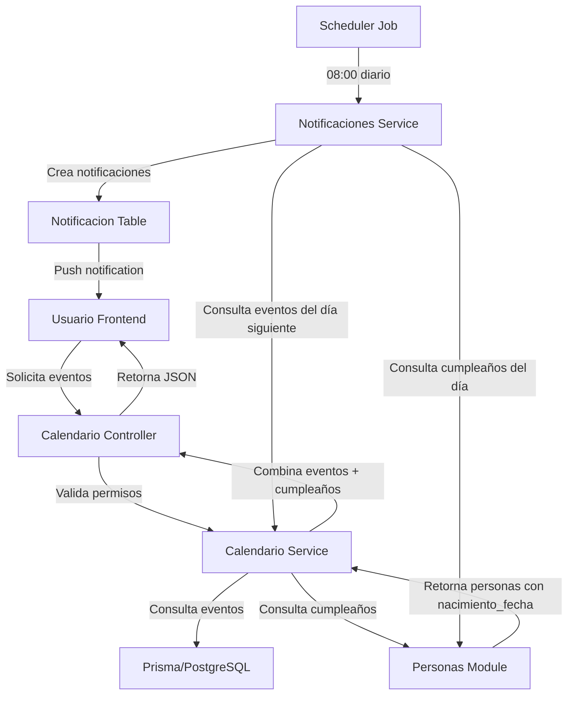

# Design Document: Módulo de Calendario/Eventos

## Overview

El módulo de Calendario/Eventos permite a los líderes y sublíderes de Casas de Paz gestionar eventos ministeriales, visualizar cumpleaños automáticos de miembros, y recibir notificaciones sobre actividades próximas. El sistema proporciona un catálogo predefinido de tipos de eventos ministeriales y ofrece vistas de calendario mensual y semanal con capacidades de filtrado.

### Objetivos Principales

- Gestionar eventos ministeriales con tipos predefinidos (RMS, AVIVATE, HOMBRES, DEBORAS, MOS, Reuniones, Mega Fiesta, Cumpleaños)
- Generar automáticamente eventos de cumpleaños desde el módulo de personas
- Proporcionar vistas de calendario mensual y semanal con filtrado por tipo de evento
- Implementar sistema de notificaciones para eventos próximos y cumpleaños
- Controlar permisos diferenciados entre líderes y sublíderes

### Alcance

El módulo incluye:
- Backend: APIs REST para CRUD de eventos, tipos de evento, y generación de cumpleaños
- Frontend: Componentes de calendario mensual/semanal, formularios de eventos, y sistema de filtros
- Base de datos: Tablas `tipo_evento` y `evento` con relaciones a `casa_de_paz` y `persona`
- Notificaciones: Job scheduler para enviar alertas de eventos próximos y cumpleaños
- Integración: Sincronización con módulo de personas para cumpleaños automáticos

## Architecture

### Arquitectura General

El módulo sigue la arquitectura NestJS modular existente del proyecto:

```
backend/
├── src/
│   └── modules/
│       └── calendario/
│           ├── calendario.module.ts
│           ├── calendario.controller.ts
│           ├── calendario.service.ts
│           ├── dto/
│           │   ├── create-evento.dto.ts
│           │   ├── update-evento.dto.ts
│           │   └── filter-eventos.dto.ts
│           └── jobs/
│               └── notificaciones-eventos.job.ts

frontend/
├── src/
│   ├── pages/
│   │   └── Calendario.tsx
│   ├── components/
│   │   └── calendario/
│   │       ├── CalendarioMensual.tsx
│   │       ├── CalendarioSemanal.tsx
│   │       ├── EventoCard.tsx
│   │       ├── EventoModal.tsx
│   │       └── FiltroTipos.tsx
│   ├── services/
│   │   └── calendario.service.ts
│   └── types/
│       └── calendario.types.ts
```


### Flujo de Datos



### Patrones de Diseño

- **Repository Pattern**: Prisma ORM como capa de acceso a datos
- **Service Layer**: Lógica de negocio en `calendario.service.ts`
- **DTO Pattern**: Validación de entrada con class-validator
- **Guard Pattern**: Control de permisos con `CasaDePazContextGuard` y `RolesGuard`
- **Job Scheduler**: NestJS Schedule para notificaciones automáticas
- **Component Composition**: React components modulares y reutilizables

## Components and Interfaces

### Backend Components

#### 1. Calendario Module

**Responsabilidad**: Módulo principal que agrupa toda la funcionalidad de calendario/eventos.

```typescript
@Module({
  imports: [
    PrismaModule,
    NotificacionesModule,
    PersonasModule,
    ScheduleModule.forRoot(),
  ],
  controllers: [CalendarioController],
  providers: [CalendarioService, NotificacionesEventosJob],
  exports: [CalendarioService],
})
export class CalendarioModule {}
```

#### 2. Calendario Controller

**Responsabilidad**: Exponer endpoints REST para operaciones de eventos.

**Endpoints**:

```typescript
// Tipos de Evento
GET    /api/calendario/tipos-evento          // Listar tipos de evento
GET    /api/calendario/tipos-evento/:id      // Obtener tipo específico

// Eventos
POST   /api/calendario/eventos               // Crear evento (Líder/Sublíder*)
GET    /api/calendario/eventos               // Listar eventos con filtros
GET    /api/calendario/eventos/:id           // Obtener evento específico
PUT    /api/calendario/eventos/:id           // Editar evento (solo Líder)
DELETE /api/calendario/eventos/:id           // Eliminar evento (solo Líder)

// Vistas de Calendario
GET    /api/calendario/mensual               // Vista mensual (año, mes, filtros)
GET    /api/calendario/semanal               // Vista semanal (año, semana, filtros)

// Cumpleaños
GET    /api/calendario/cumpleanos            // Listar cumpleaños del mes
```

*Sublíderes solo pueden crear tipos: RMS, AVIVATE, HOMBRES, DEBORAS, MOS


#### 3. Calendario Service

**Responsabilidad**: Lógica de negocio para gestión de eventos y cumpleaños.

**Métodos principales**:

```typescript
class CalendarioService {
  // Tipos de Evento
  async getTiposEvento(): Promise<TipoEvento[]>
  async getTipoEventoById(id: number): Promise<TipoEvento>
  
  // Eventos CRUD
  async createEvento(dto: CreateEventoDto, userId: number): Promise<Evento>
  async updateEvento(id: number, dto: UpdateEventoDto, userId: number): Promise<Evento>
  async deleteEvento(id: number, userId: number): Promise<void>
  async getEventoById(id: number): Promise<Evento>
  async getEventos(filtros: FilterEventosDto, casaDePazId: number): Promise<Evento[]>
  
  // Vistas de Calendario
  async getEventosMensual(año: number, mes: number, casaDePazId: number, filtros?: string[]): Promise<EventoCalendario[]>
  async getEventosSemanales(año: number, semana: number, casaDePazId: number, filtros?: string[]): Promise<EventoCalendario[]>
  
  // Cumpleaños
  async getCumpleanosMes(año: number, mes: number, casaDePazId: number): Promise<CumpleanosEvento[]>
  async generarEventoCumpleanos(persona: Persona, año: number): Promise<CumpleanosEvento>
  
  // Validaciones y Permisos
  async validarPermisoCreacion(userId: number, tipoEventoId: number): Promise<boolean>
  async validarPermisoEdicion(userId: number, eventoId: number): Promise<boolean>
  async validarPermisoCasaDePaz(userId: number, casaDePazId: number): Promise<boolean>
}
```

#### 4. Notificaciones Eventos Job

**Responsabilidad**: Job programado para enviar notificaciones de eventos y cumpleaños.

```typescript
@Injectable()
export class NotificacionesEventosJob {
  @Cron('0 8 * * *') // Ejecutar diariamente a las 08:00
  async enviarNotificacionesEventos() {
    // 1. Obtener eventos del día siguiente
    // 2. Obtener cumpleaños del día actual
    // 3. Crear notificaciones para líderes y sublíderes
    // 4. Marcar eventos como notificados
  }
}
```

### Frontend Components

#### 1. Página Calendario

**Responsabilidad**: Página principal del módulo con navegación entre vistas.

```typescript
interface CalendarioPageProps {}

const CalendarioPage: React.FC<CalendarioPageProps> = () => {
  const [vista, setVista] = useState<'mensual' | 'semanal'>('mensual');
  const [fecha, setFecha] = useState<Date>(new Date());
  const [filtros, setFiltros] = useState<number[]>([]);
  
  return (
    <div>
      <CalendarioHeader 
        vista={vista} 
        onVistaChange={setVista}
        fecha={fecha}
        onFechaChange={setFecha}
      />
      <FiltroTipos 
        filtrosActivos={filtros}
        onFiltrosChange={setFiltros}
      />
      {vista === 'mensual' ? (
        <CalendarioMensual fecha={fecha} filtros={filtros} />
      ) : (
        <CalendarioSemanal fecha={fecha} filtros={filtros} />
      )}
    </div>
  );
};
```


#### 2. Calendario Mensual Component

**Responsabilidad**: Renderizar vista de calendario mensual con eventos.

```typescript
interface CalendarioMensualProps {
  fecha: Date;
  filtros: number[];
}

const CalendarioMensual: React.FC<CalendarioMensualProps> = ({ fecha, filtros }) => {
  const { data: eventos, isLoading } = useEventosMensual(fecha, filtros);
  const diasDelMes = generarDiasDelMes(fecha);
  
  return (
    <div className="grid grid-cols-7 gap-2">
      {/* Headers de días de la semana */}
      {['Dom', 'Lun', 'Mar', 'Mié', 'Jue', 'Vie', 'Sáb'].map(dia => (
        <div key={dia} className="font-semibold text-center">{dia}</div>
      ))}
      
      {/* Días del mes */}
      {diasDelMes.map(dia => (
        <DiaCalendario 
          key={dia.fecha.toISOString()}
          dia={dia}
          eventos={eventos?.filter(e => isSameDay(e.fecha, dia.fecha))}
          esHoy={isToday(dia.fecha)}
        />
      ))}
    </div>
  );
};
```

#### 3. Calendario Semanal Component

**Responsabilidad**: Renderizar vista de calendario semanal con horarios.

```typescript
interface CalendarioSemanalProps {
  fecha: Date;
  filtros: number[];
}

const CalendarioSemanal: React.FC<CalendarioSemanalProps> = ({ fecha, filtros }) => {
  const { data: eventos, isLoading } = useEventosSemanales(fecha, filtros);
  const diasDeLaSemana = generarDiasDeLaSemana(fecha);
  
  return (
    <div className="grid grid-cols-8 gap-2">
      {/* Primera columna: horas */}
      <div className="col-span-1">
        {Array.from({ length: 24 }, (_, i) => (
          <div key={i} className="h-12 border-b text-sm">
            {i.toString().padStart(2, '0')}:00
          </div>
        ))}
      </div>
      
      {/* Columnas de días */}
      {diasDeLaSemana.map(dia => (
        <DiaCalendarioSemanal
          key={dia.fecha.toISOString()}
          dia={dia}
          eventos={eventos?.filter(e => isSameDay(e.fecha, dia.fecha))}
        />
      ))}
    </div>
  );
};
```

#### 4. Evento Modal Component

**Responsabilidad**: Modal para crear/editar/ver detalles de eventos.

```typescript
interface EventoModalProps {
  evento?: Evento;
  isOpen: boolean;
  onClose: () => void;
  modo: 'crear' | 'editar' | 'ver';
}

const EventoModal: React.FC<EventoModalProps> = ({ evento, isOpen, onClose, modo }) => {
  const { user } = useAuthStore();
  const esLider = user?.roles.includes('LIDER_CDP');
  const puedeEditar = modo === 'crear' || (modo === 'editar' && esLider);
  
  return (
    <Dialog open={isOpen} onOpenChange={onClose}>
      <DialogContent>
        <DialogHeader>
          <DialogTitle>
            {modo === 'crear' ? 'Nuevo Evento' : 
             modo === 'editar' ? 'Editar Evento' : 
             'Detalles del Evento'}
          </DialogTitle>
        </DialogHeader>
        
        {puedeEditar ? (
          <EventoForm evento={evento} onSubmit={handleSubmit} />
        ) : (
          <EventoDetalle evento={evento} />
        )}
      </DialogContent>
    </Dialog>
  );
};
```


#### 5. Filtro Tipos Component

**Responsabilidad**: Componente para filtrar eventos por tipo.

```typescript
interface FiltroTiposProps {
  filtrosActivos: number[];
  onFiltrosChange: (filtros: number[]) => void;
}

const FiltroTipos: React.FC<FiltroTiposProps> = ({ filtrosActivos, onFiltrosChange }) => {
  const { data: tiposEvento } = useTiposEvento();
  
  const toggleFiltro = (tipoId: number) => {
    if (filtrosActivos.includes(tipoId)) {
      onFiltrosChange(filtrosActivos.filter(id => id !== tipoId));
    } else {
      onFiltrosChange([...filtrosActivos, tipoId]);
    }
  };
  
  return (
    <div className="flex gap-2 flex-wrap mb-4">
      {tiposEvento?.map(tipo => (
        <button
          key={tipo.id}
          onClick={() => toggleFiltro(tipo.id)}
          className={cn(
            "px-3 py-1 rounded-full text-sm flex items-center gap-2",
            filtrosActivos.includes(tipo.id) 
              ? "bg-primary text-white" 
              : "bg-gray-200"
          )}
          style={{ 
            backgroundColor: filtrosActivos.includes(tipo.id) ? tipo.color : undefined 
          }}
        >
          
          {tipo.nombre}
        </button>
      ))}
    </div>
  );
};
```

### Services

#### Calendario Service (Frontend)

```typescript
class CalendarioService {
  private api = axios.create({ baseURL: '/api/calendario' });
  
  // Tipos de Evento
  async getTiposEvento(): Promise<TipoEvento[]> {
    const { data } = await this.api.get('/tipos-evento');
    return data;
  }
  
  // Eventos
  async createEvento(dto: CreateEventoDto): Promise<Evento> {
    const { data } = await this.api.post('/eventos', dto);
    return data;
  }
  
  async updateEvento(id: number, dto: UpdateEventoDto): Promise<Evento> {
    const { data } = await this.api.put(`/eventos/${id}`, dto);
    return data;
  }
  
  async deleteEvento(id: number): Promise<void> {
    await this.api.delete(`/eventos/${id}`);
  }
  
  async getEventos(filtros: FilterEventosDto): Promise<Evento[]> {
    const { data } = await this.api.get('/eventos', { params: filtros });
    return data;
  }
  
  // Vistas de Calendario
  async getEventosMensual(año: number, mes: number, filtros?: number[]): Promise<EventoCalendario[]> {
    const { data } = await this.api.get('/mensual', { 
      params: { año, mes, tipos: filtros?.join(',') } 
    });
    return data;
  }
  
  async getEventosSemanales(año: number, semana: number, filtros?: number[]): Promise<EventoCalendario[]> {
    const { data } = await this.api.get('/semanal', { 
      params: { año, semana, tipos: filtros?.join(',') } 
    });
    return data;
  }
}

export const calendarioService = new CalendarioService();
```


## Data Models

### Database Schema

#### Tabla: tipo_evento

Almacena el catálogo de tipos de eventos ministeriales.

```sql
CREATE TABLE tipo_evento (
  id                SERIAL PRIMARY KEY,
  nombre            VARCHAR(100) NOT NULL,
  icono             VARCHAR(255) NOT NULL,  -- URL o path al icono PNG
  descripcion       TEXT,
  color             VARCHAR(7) NOT NULL,    -- Código hexadecimal (ej: #FF5733)
  created_at        TIMESTAMP NOT NULL DEFAULT NOW(),
  updated_at        TIMESTAMP NOT NULL DEFAULT NOW(),
  created_by        INTEGER,
  updated_by        INTEGER,
  deleted_at        TIMESTAMP,
  deleted_by        INTEGER
);

-- Índices
CREATE INDEX idx_tipo_evento_nombre ON tipo_evento(nombre);
CREATE INDEX idx_tipo_evento_deleted ON tipo_evento(deleted_at);
```

**Datos iniciales**:

```sql
INSERT INTO tipo_evento (nombre, icono, descripcion, color) VALUES
('RMS', '/icons/rms.png', 'Reunión de Ministerio Semanal', '#3B82F6'),
('AVIVATE', '/icons/avivate.png', 'Reunión Avívate', '#10B981'),
('HOMBRES', '/icons/hombres.png', 'Reunión de Hombres', '#6366F1'),
('DEBORAS', '/icons/deboras.png', 'Reunión de Déboras', '#EC4899'),
('MOS', '/icons/mos.png', 'Ministerio de Oración y Sanidad', '#8B5CF6'),
('Reuniones', '/icons/reuniones.png', 'Reuniones Generales', '#F59E0B'),
('Mega Fiesta de Casa de Paz', '/icons/mega-fiesta.png', 'Mega Fiesta', '#EF4444'),
('Cumpleaños', '/icons/cumpleanos.png', 'Cumpleaños de Miembro', '#06B6D4');
```

#### Tabla: evento

Almacena los eventos creados por líderes y sublíderes.

```sql
CREATE TABLE evento (
  id                SERIAL PRIMARY KEY,
  casa_de_paz_id    INTEGER NOT NULL REFERENCES casa_de_paz(id),
  tipo_evento_id    INTEGER NOT NULL REFERENCES tipo_evento(id),
  titulo            VARCHAR(200) NOT NULL,
  descripcion       TEXT,
  fecha_evento      DATE NOT NULL,
  hora_evento       TIME,
  todo_el_dia       BOOLEAN NOT NULL DEFAULT FALSE,
  notificado        BOOLEAN NOT NULL DEFAULT FALSE,  -- Para control de notificaciones
  created_at        TIMESTAMP NOT NULL DEFAULT NOW(),
  updated_at        TIMESTAMP NOT NULL DEFAULT NOW(),
  created_by        INTEGER NOT NULL,
  updated_by        INTEGER NOT NULL,
  deleted_at        TIMESTAMP,
  deleted_by        INTEGER,
  
  CONSTRAINT chk_fecha_evento CHECK (fecha_evento >= CURRENT_DATE),
  CONSTRAINT chk_hora_todo_dia CHECK (
    (todo_el_dia = TRUE AND hora_evento IS NULL) OR 
    (todo_el_dia = FALSE AND hora_evento IS NOT NULL)
  )
);

-- Índices
CREATE INDEX idx_evento_casa_de_paz ON evento(casa_de_paz_id);
CREATE INDEX idx_evento_tipo ON evento(tipo_evento_id);
CREATE INDEX idx_evento_fecha ON evento(fecha_evento);
CREATE INDEX idx_evento_deleted ON evento(deleted_at);
CREATE INDEX idx_evento_notificado ON evento(notificado) WHERE deleted_at IS NULL;

-- Índice compuesto para consultas de calendario
CREATE INDEX idx_evento_calendario ON evento(casa_de_paz_id, fecha_evento, deleted_at);
```


### Prisma Schema

```prisma
model TipoEvento {
  id          Int       @id @default(autoincrement())
  nombre      String    @db.VarChar(100)
  icono       String    @db.VarChar(255)
  descripcion String?   @db.Text
  color       String    @db.VarChar(7)
  createdAt   DateTime  @default(now()) @map("created_at")
  updatedAt   DateTime  @updatedAt @map("updated_at")
  createdBy   Int?      @map("created_by")
  updatedBy   Int?      @map("updated_by")
  deletedAt   DateTime? @map("deleted_at")
  deletedBy   Int?      @map("deleted_by")
  
  // Relations
  eventos     Evento[]
  
  @@index([nombre])
  @@index([deletedAt])
  @@map("tipo_evento")
}

model Evento {
  id            Int       @id @default(autoincrement())
  casaDePazId   Int       @map("casa_de_paz_id")
  tipoEventoId  Int       @map("tipo_evento_id")
  titulo        String    @db.VarChar(200)
  descripcion   String?   @db.Text
  fechaEvento   DateTime  @map("fecha_evento") @db.Date
  horaEvento    DateTime? @map("hora_evento") @db.Time
  todoElDia     Boolean   @default(false) @map("todo_el_dia")
  notificado    Boolean   @default(false)
  createdAt     DateTime  @default(now()) @map("created_at")
  updatedAt     DateTime  @updatedAt @map("updated_at")
  createdBy     Int       @map("created_by")
  updatedBy     Int       @map("updated_by")
  deletedAt     DateTime? @map("deleted_at")
  deletedBy     Int?      @map("deleted_by")
  
  // Relations
  casaDePaz     CasaDePaz  @relation(fields: [casaDePazId], references: [id])
  tipoEvento    TipoEvento @relation(fields: [tipoEventoId], references: [id])
  
  @@index([casaDePazId])
  @@index([tipoEventoId])
  @@index([fechaEvento])
  @@index([deletedAt])
  @@index([notificado])
  @@index([casaDePazId, fechaEvento, deletedAt])
  @@map("evento")
}
```

### TypeScript Interfaces

#### Backend DTOs

```typescript
// create-evento.dto.ts
export class CreateEventoDto {
  @IsInt()
  @IsNotEmpty()
  casaDePazId: number;
  
  @IsInt()
  @IsNotEmpty()
  tipoEventoId: number;
  
  @IsString()
  @IsNotEmpty()
  @MaxLength(200)
  titulo: string;
  
  @IsString()
  @IsOptional()
  descripcion?: string;
  
  @IsDateString()
  @IsNotEmpty()
  fechaEvento: string;
  
  @IsString()
  @IsOptional()
  @Matches(/^([0-1]?[0-9]|2[0-3]):[0-5][0-9]$/)
  horaEvento?: string;
  
  @IsBoolean()
  @IsOptional()
  todoElDia?: boolean;
}

// update-evento.dto.ts
export class UpdateEventoDto {
  @IsInt()
  @IsOptional()
  tipoEventoId?: number;
  
  @IsString()
  @IsOptional()
  @MaxLength(200)
  titulo?: string;
  
  @IsString()
  @IsOptional()
  descripcion?: string;
  
  @IsDateString()
  @IsOptional()
  fechaEvento?: string;
  
  @IsString()
  @IsOptional()
  @Matches(/^([0-1]?[0-9]|2[0-3]):[0-5][0-9]$/)
  horaEvento?: string;
  
  @IsBoolean()
  @IsOptional()
  todoElDia?: boolean;
}

// filter-eventos.dto.ts
export class FilterEventosDto {
  @IsInt()
  @IsOptional()
  casaDePazId?: number;
  
  @IsArray()
  @IsInt({ each: true })
  @IsOptional()
  tipoEventoIds?: number[];
  
  @IsDateString()
  @IsOptional()
  fechaDesde?: string;
  
  @IsDateString()
  @IsOptional()
  fechaHasta?: string;
}
```


#### Frontend Types

```typescript
// calendario.types.ts

export interface TipoEvento {
  id: number;
  nombre: string;
  icono: string;
  descripcion?: string;
  color: string;
}

export interface Evento {
  id: number;
  casaDePazId: number;
  tipoEventoId: number;
  tipoEvento: TipoEvento;
  titulo: string;
  descripcion?: string;
  fechaEvento: string;
  horaEvento?: string;
  todoElDia: boolean;
  createdAt: string;
  createdBy: number;
  updatedAt: string;
  updatedBy: number;
}

export interface EventoCalendario extends Evento {
  esCumpleanos: boolean;
  personaNombre?: string;
}

export interface CumpleanosEvento {
  id: string; // Generado como "cumpleanos-{personaId}-{año}"
  personaId: number;
  personaNombre: string;
  fechaNacimiento: string;
  fechaEvento: string;
  edad: number;
  tipoEvento: TipoEvento;
}

export interface DiaCalendario {
  fecha: Date;
  esDelMesActual: boolean;
  esHoy: boolean;
  eventos: EventoCalendario[];
}

export interface CreateEventoForm {
  tipoEventoId: number;
  titulo: string;
  descripcion?: string;
  fechaEvento: Date;
  horaEvento?: string;
  todoElDia: boolean;
}

export interface UpdateEventoForm extends Partial<CreateEventoForm> {}
```

### Integración con Módulo de Personas

El módulo de calendario se integra con el módulo de personas para generar eventos de cumpleaños automáticamente:

```typescript
// En calendario.service.ts

async getCumpleanosMes(año: number, mes: number, casaDePazId: number): Promise<CumpleanosEvento[]> {
  // 1. Obtener todas las personas de la casa de paz con fecha de nacimiento
  const personas = await this.prisma.persona.findMany({
    where: {
      casasDePazMembresia: {
        some: {
          casaDePazId,
          deletedAt: null,
          fechaFinMiembro: null,
        },
      },
      nacimientoFecha: {
        not: null,
      },
      deletedAt: null,
    },
    select: {
      id: true,
      primerNombre: true,
      segundoNombre: true,
      primerApellido: true,
      segundoApellido: true,
      nacimientoFecha: true,
    },
  });
  
  // 2. Obtener el tipo de evento "Cumpleaños"
  const tipoCumpleanos = await this.prisma.tipoEvento.findFirst({
    where: { nombre: 'Cumpleaños', deletedAt: null },
  });
  
  if (!tipoCumpleanos) {
    throw new Error('Tipo de evento Cumpleaños no encontrado');
  }
  
  // 3. Filtrar personas cuyo cumpleaños cae en el mes solicitado
  const cumpleanos: CumpleanosEvento[] = [];
  
  for (const persona of personas) {
    const fechaNacimiento = new Date(persona.nacimientoFecha);
    const mesCumpleanos = fechaNacimiento.getMonth() + 1;
    
    // Caso especial: 29 de febrero en año no bisiesto
    let diaCumpleanos = fechaNacimiento.getDate();
    if (mesCumpleanos === 2 && diaCumpleanos === 29 && !this.esAnioBisiesto(año)) {
      diaCumpleanos = 28;
    }
    
    if (mesCumpleanos === mes) {
      const fechaEvento = new Date(año, mes - 1, diaCumpleanos);
      const edad = año - fechaNacimiento.getFullYear();
      
      cumpleanos.push({
        id: `cumpleanos-${persona.id}-${año}`,
        personaId: persona.id,
        personaNombre: this.formatNombreCompleto(persona),
        fechaNacimiento: persona.nacimientoFecha.toISOString(),
        fechaEvento: fechaEvento.toISOString(),
        edad,
        tipoEvento: tipoCumpleanos,
      });
    }
  }
  
  return cumpleanos;
}

private esAnioBisiesto(año: number): boolean {
  return (año % 4 === 0 && año % 100 !== 0) || (año % 400 === 0);
}

private formatNombreCompleto(persona: any): string {
  let nombre = `${persona.primerNombre}`;
  if (persona.segundoNombre) nombre += ` ${persona.segundoNombre}`;
  nombre += ` ${persona.primerApellido}`;
  if (persona.segundoApellido) nombre += ` ${persona.segundoApellido}`;
  return nombre;
}
```


## Correctness Properties

*A property is a characteristic or behavior that should hold true across all valid executions of a system-essentially, a formal statement about what the system should do. Properties serve as the bridge between human-readable specifications and machine-verifiable correctness guarantees.*

### Property 1: Evento asociado a casa de paz del creador

*For any* líder creando un evento, el evento creado debe estar asociado únicamente a la casa de paz del líder.

**Validates: Requirements 2.2**

### Property 2: Campos de auditoría en creación

*For any* evento creado, los campos created_at, created_by, updated_at y updated_by deben estar presentes y no ser nulos.

**Validates: Requirements 2.3**

### Property 3: Hora opcional con todo_el_dia

*For any* evento con todo_el_dia=true, el campo hora_evento puede ser nulo; para eventos con todo_el_dia=false, hora_evento debe estar presente.

**Validates: Requirements 2.4**

### Property 4: Validación de fecha futura

*For any* intento de crear un evento con fecha_evento anterior a la fecha actual, el sistema debe rechazar la operación.

**Validates: Requirements 2.5**

### Property 5: Campos obligatorios completos

*For any* intento de crear un evento sin los campos obligatorios (casaDePazId, tipoEventoId, titulo, fechaEvento), el sistema debe rechazar la operación.

**Validates: Requirements 2.6**

### Property 6: Actualización de campos de auditoría en edición

*For any* evento editado, los campos updated_at y updated_by deben cambiar, mientras que created_at y created_by deben permanecer sin cambios.

**Validates: Requirements 3.2, 3.4**

### Property 7: Restricción de edición por casa de paz

*For any* líder intentando editar un evento que no pertenece a su casa de paz, el sistema debe denegar la operación.

**Validates: Requirements 3.3**

### Property 8: Eliminación lógica con campos de auditoría

*For any* evento eliminado, los campos deleted_at y deleted_by deben ser establecidos, y los datos del evento deben permanecer en la base de datos.

**Validates: Requirements 4.1, 4.4**

### Property 9: Exclusión de eventos eliminados

*For any* consulta de listado de eventos, los eventos con deleted_at no nulo no deben aparecer en los resultados.

**Validates: Requirements 4.2, 5.2**

### Property 10: Restricción de eliminación por casa de paz

*For any* líder intentando eliminar un evento que no pertenece a su casa de paz, el sistema debe denegar la operación.

**Validates: Requirements 4.3**

### Property 11: Filtrado por casa de paz

*For any* usuario (líder o sublíder) solicitando listar eventos, solo deben mostrarse eventos de su casa de paz.

**Validates: Requirements 5.1**

### Property 12: Ordenamiento por fecha ascendente

*For any* lista de eventos retornada, los eventos deben estar ordenados por fecha_evento de forma ascendente.

**Validates: Requirements 5.3**

### Property 13: Campos completos en listado

*For any* evento en la lista, debe incluir tipoEvento, titulo, fechaEvento, horaEvento y descripcion en la respuesta.

**Validates: Requirements 5.4**


### Property 14: Eventos con icono y título en vista mensual

*For any* día con eventos en la vista mensual, cada evento debe incluir su icono y título.

**Validates: Requirements 6.2**

### Property 15: Eventos con hora, icono y título en vista semanal

*For any* día con eventos en la vista semanal, cada evento debe incluir hora, icono y título.

**Validates: Requirements 7.2**

### Property 16: Ordenamiento por hora en vista semanal

*For any* día con múltiples eventos en la vista semanal, los eventos deben estar ordenados por hora de inicio.

**Validates: Requirements 7.4**

### Property 17: Filtrado por tipo de evento

*For any* filtro de tipo de evento aplicado, solo eventos del tipo seleccionado deben aparecer en los resultados.

**Validates: Requirements 8.1**

### Property 18: Sin filtros muestra todos los eventos

*For any* consulta sin filtros activos, todos los tipos de eventos deben aparecer en los resultados.

**Validates: Requirements 8.3**

### Property 19: Generación de cumpleaños automáticos

*For any* persona con nacimiento_fecha definido en su casa de paz, debe generarse un evento de cumpleaños en la fecha correspondiente del año actual.

**Validates: Requirements 9.1**

### Property 20: Tipo y nombre en cumpleaños

*For any* cumpleaños generado, debe tener el tipo "Cumpleaños" y el título debe contener el nombre de la persona.

**Validates: Requirements 9.2, 9.3**

### Property 21: Actualización de cumpleaños al modificar fecha de nacimiento

*For any* cambio en nacimiento_fecha de una persona, el cumpleaños en el calendario debe actualizarse para reflejar la nueva fecha.

**Validates: Requirements 9.5**

### Property 22: Notificación de eventos próximos

*For any* evento programado para el día siguiente, debe generarse una notificación para el líder y sublíderes de la casa de paz.

**Validates: Requirements 10.1**

### Property 23: Contenido de notificación de evento

*For any* notificación de evento, debe incluir tipo, título, fecha y hora del evento.

**Validates: Requirements 10.2**

### Property 24: Notificación única por evento

*For any* evento, solo debe enviarse una notificación (campo notificado debe evitar duplicados).

**Validates: Requirements 10.3**

### Property 25: Notificación de cumpleaños del día

*For any* cumpleaños del día actual, debe generarse una notificación para el líder y sublíderes de la casa de paz.

**Validates: Requirements 11.1**

### Property 26: Nombre en notificación de cumpleaños

*For any* notificación de cumpleaños, debe incluir el nombre de la persona que cumple años.

**Validates: Requirements 11.2**

### Property 27: Notificación por cada cumpleaños

*For any* día con múltiples cumpleaños, debe generarse una notificación separada por cada persona.

**Validates: Requirements 11.4**

### Property 28: Líder puede crear cualquier tipo de evento

*For any* usuario con rol de líder, debe poder crear eventos de cualquier tipo de evento disponible.

**Validates: Requirements 12.1**

### Property 29: Líder puede editar eventos de su casa de paz

*For any* usuario con rol de líder y cualquier evento de su casa de paz, debe poder editarlo.

**Validates: Requirements 12.2**

### Property 30: Líder puede eliminar eventos de su casa de paz

*For any* usuario con rol de líder y cualquier evento de su casa de paz, debe poder eliminarlo.

**Validates: Requirements 12.3**


### Property 31: Restricción de líder a su casa de paz

*For any* usuario con rol de líder intentando operar sobre eventos de otra casa de paz, el sistema debe denegar la operación.

**Validates: Requirements 12.4**

### Property 32: Sublíder puede visualizar eventos

*For any* usuario con rol de sublíder, debe poder visualizar todos los eventos de su casa de paz.

**Validates: Requirements 13.1**

### Property 33: Sublíder puede crear tipos específicos

*For any* usuario con rol de sublíder, debe poder crear eventos solo de tipos: RMS, AVIVATE, HOMBRES, DEBORAS y MOS.

**Validates: Requirements 13.2**

### Property 34: Sublíder no puede crear tipos restringidos

*For any* usuario con rol de sublíder intentando crear eventos de tipo "Reuniones" o "Mega Fiesta de Casa de Paz", el sistema debe denegar la operación.

**Validates: Requirements 13.3**

### Property 35: Sublíder no puede editar ni eliminar

*For any* usuario con rol de sublíder intentando editar o eliminar cualquier evento, el sistema debe denegar la operación.

**Validates: Requirements 13.4**

### Property 36: Restricción de sublíder a su casa de paz

*For any* usuario con rol de sublíder intentando operar sobre eventos de otra casa de paz, el sistema debe denegar la operación.

**Validates: Requirements 13.5**

## Error Handling

### Errores de Validación

```typescript
// Errores de validación de entrada
export class EventoValidationError extends BadRequestException {
  constructor(message: string) {
    super({
      statusCode: 400,
      message,
      error: 'Validation Error',
    });
  }
}

// Ejemplos de uso:
- "La fecha del evento no puede ser anterior a la fecha actual"
- "El campo título es obligatorio"
- "El formato de hora debe ser HH:MM"
- "Cuando todo_el_dia es true, no se debe proporcionar hora"
```

### Errores de Autorización

```typescript
// Errores de permisos
export class EventoAuthorizationError extends ForbiddenException {
  constructor(message: string) {
    super({
      statusCode: 403,
      message,
      error: 'Authorization Error',
    });
  }
}

// Ejemplos de uso:
- "No tiene permisos para crear eventos de este tipo"
- "No tiene permisos para editar eventos de otra casa de paz"
- "Los sublíderes no pueden eliminar eventos"
- "No tiene permisos para acceder a eventos de esta casa de paz"
```

### Errores de Negocio

```typescript
// Errores de lógica de negocio
export class EventoBusinessError extends BadRequestException {
  constructor(message: string) {
    super({
      statusCode: 400,
      message,
      error: 'Business Logic Error',
    });
  }
}

// Ejemplos de uso:
- "El tipo de evento no existe"
- "La casa de paz no existe"
- "El evento ya fue notificado"
```

### Errores de Recursos No Encontrados

```typescript
// Errores 404
export class EventoNotFoundError extends NotFoundException {
  constructor(eventoId: number) {
    super({
      statusCode: 404,
      message: `Evento con ID ${eventoId} no encontrado`,
      error: 'Not Found',
    });
  }
}
```


### Manejo de Errores en Frontend

```typescript
// En calendario.service.ts
async createEvento(dto: CreateEventoDto): Promise<Evento> {
  try {
    const { data } = await this.api.post('/eventos', dto);
    return data;
  } catch (error) {
    if (axios.isAxiosError(error)) {
      const status = error.response?.status;
      const message = error.response?.data?.message || 'Error al crear evento';
      
      switch (status) {
        case 400:
          throw new Error(`Validación: ${message}`);
        case 403:
          throw new Error(`Permisos: ${message}`);
        case 404:
          throw new Error(`No encontrado: ${message}`);
        default:
          throw new Error('Error inesperado al crear evento');
      }
    }
    throw error;
  }
}

// En componentes React
const handleCreateEvento = async (formData: CreateEventoForm) => {
  try {
    await calendarioService.createEvento(formData);
    toast.success('Evento creado exitosamente');
    onClose();
    refetch();
  } catch (error) {
    if (error instanceof Error) {
      toast.error(error.message);
    } else {
      toast.error('Error al crear evento');
    }
  }
};
```

## Testing Strategy

### Enfoque Dual de Testing

El módulo de calendario/eventos implementará dos tipos complementarios de pruebas:

1. **Unit Tests**: Para casos específicos, ejemplos concretos y casos edge
2. **Property-Based Tests**: Para propiedades universales que deben cumplirse con cualquier entrada

### Unit Testing

Los unit tests se enfocarán en:

- Casos específicos de validación de entrada
- Integración entre componentes
- Casos edge (ej: 29 de febrero en año no bisiesto)
- Manejo de errores específicos

**Ejemplos de Unit Tests**:

```typescript
describe('CalendarioService - Unit Tests', () => {
  describe('createEvento', () => {
    it('debe crear un evento con todos los campos válidos', async () => {
      const dto: CreateEventoDto = {
        casaDePazId: 1,
        tipoEventoId: 1,
        titulo: 'Reunión RMS',
        fechaEvento: '2024-12-25',
        horaEvento: '19:00',
        todoElDia: false,
      };
      
      const evento = await service.createEvento(dto, 1);
      
      expect(evento).toBeDefined();
      expect(evento.titulo).toBe('Reunión RMS');
      expect(evento.createdBy).toBe(1);
    });
    
    it('debe rechazar evento con fecha pasada', async () => {
      const dto: CreateEventoDto = {
        casaDePazId: 1,
        tipoEventoId: 1,
        titulo: 'Evento Pasado',
        fechaEvento: '2020-01-01',
        horaEvento: '19:00',
        todoElDia: false,
      };
      
      await expect(service.createEvento(dto, 1)).rejects.toThrow(
        'La fecha del evento no puede ser anterior a la fecha actual'
      );
    });
    
    it('debe permitir evento de todo el día sin hora', async () => {
      const dto: CreateEventoDto = {
        casaDePazId: 1,
        tipoEventoId: 1,
        titulo: 'Evento Todo el Día',
        fechaEvento: '2024-12-25',
        todoElDia: true,
      };
      
      const evento = await service.createEvento(dto, 1);
      
      expect(evento.todoElDia).toBe(true);
      expect(evento.horaEvento).toBeNull();
    });
  });
  
  describe('getCumpleanosMes - Edge Cases', () => {
    it('debe manejar 29 de febrero en año no bisiesto', async () => {
      // Crear persona con cumpleaños 29 de febrero
      const persona = await prisma.persona.create({
        data: {
          primerNombre: 'Juan',
          primerApellido: 'Pérez',
          nacimientoFecha: new Date('2000-02-29'),
          sexo: 'M',
        },
      });
      
      // Consultar cumpleaños en año no bisiesto (2023)
      const cumpleanos = await service.getCumpleanosMes(2023, 2, 1);
      
      const juanCumpleanos = cumpleanos.find(c => c.personaId === persona.id);
      expect(juanCumpleanos).toBeDefined();
      expect(juanCumpleanos.fechaEvento).toBe('2023-02-28');
    });
  });
});
```


### Property-Based Testing

Los property tests verificarán propiedades universales usando una librería de PBT como **fast-check** (para TypeScript/JavaScript).

**Configuración**:
- Mínimo 100 iteraciones por test
- Cada test debe referenciar la propiedad del diseño
- Tag format: `Feature: calendario-eventos, Property {number}: {property_text}`

**Ejemplos de Property Tests**:

```typescript
import * as fc from 'fast-check';

describe('CalendarioService - Property Tests', () => {
  /**
   * Feature: calendario-eventos, Property 2: Campos de auditoría en creación
   * For any evento creado, los campos created_at, created_by, updated_at y updated_by 
   * deben estar presentes y no ser nulos.
   */
  it('Property 2: Campos de auditoría siempre presentes en creación', async () => {
    await fc.assert(
      fc.asyncProperty(
        fc.record({
          casaDePazId: fc.integer({ min: 1, max: 100 }),
          tipoEventoId: fc.integer({ min: 1, max: 8 }),
          titulo: fc.string({ minLength: 1, maxLength: 200 }),
          fechaEvento: fc.date({ min: new Date() }),
          horaEvento: fc.option(fc.constantFrom('09:00', '14:00', '19:00')),
          todoElDia: fc.boolean(),
        }),
        fc.integer({ min: 1, max: 1000 }),
        async (eventoData, userId) => {
          const evento = await service.createEvento(eventoData, userId);
          
          expect(evento.createdAt).toBeDefined();
          expect(evento.createdBy).toBe(userId);
          expect(evento.updatedAt).toBeDefined();
          expect(evento.updatedBy).toBe(userId);
        }
      ),
      { numRuns: 100 }
    );
  });
  
  /**
   * Feature: calendario-eventos, Property 9: Exclusión de eventos eliminados
   * For any consulta de listado de eventos, los eventos con deleted_at no nulo 
   * no deben aparecer en los resultados.
   */
  it('Property 9: Eventos eliminados no aparecen en listados', async () => {
    await fc.assert(
      fc.asyncProperty(
        fc.integer({ min: 1, max: 100 }),
        async (casaDePazId) => {
          // Crear varios eventos
          const eventos = await Promise.all([
            service.createEvento({ /* ... */ }, 1),
            service.createEvento({ /* ... */ }, 1),
            service.createEvento({ /* ... */ }, 1),
          ]);
          
          // Eliminar algunos eventos aleatoriamente
          const eventosAEliminar = fc.sample(
            fc.subarray(eventos, { minLength: 1 }),
            1
          )[0];
          
          for (const evento of eventosAEliminar) {
            await service.deleteEvento(evento.id, 1);
          }
          
          // Listar eventos
          const eventosActivos = await service.getEventos(
            { casaDePazId },
            casaDePazId
          );
          
          // Verificar que ningún evento eliminado aparezca
          const idsEliminados = eventosAEliminar.map(e => e.id);
          const idsActivos = eventosActivos.map(e => e.id);
          
          for (const idEliminado of idsEliminados) {
            expect(idsActivos).not.toContain(idEliminado);
          }
        }
      ),
      { numRuns: 100 }
    );
  });
  
  /**
   * Feature: calendario-eventos, Property 12: Ordenamiento por fecha ascendente
   * For any lista de eventos retornada, los eventos deben estar ordenados 
   * por fecha_evento de forma ascendente.
   */
  it('Property 12: Eventos siempre ordenados por fecha ascendente', async () => {
    await fc.assert(
      fc.asyncProperty(
        fc.integer({ min: 1, max: 100 }),
        fc.array(
          fc.record({
            titulo: fc.string({ minLength: 1, maxLength: 50 }),
            fechaEvento: fc.date({ 
              min: new Date(), 
              max: new Date(Date.now() + 365 * 24 * 60 * 60 * 1000) 
            }),
          }),
          { minLength: 2, maxLength: 20 }
        ),
        async (casaDePazId, eventosData) => {
          // Crear eventos con fechas aleatorias
          await Promise.all(
            eventosData.map(data =>
              service.createEvento(
                {
                  casaDePazId,
                  tipoEventoId: 1,
                  ...data,
                  todoElDia: true,
                },
                1
              )
            )
          );
          
          // Obtener lista de eventos
          const eventos = await service.getEventos({ casaDePazId }, casaDePazId);
          
          // Verificar ordenamiento
          for (let i = 0; i < eventos.length - 1; i++) {
            const fecha1 = new Date(eventos[i].fechaEvento);
            const fecha2 = new Date(eventos[i + 1].fechaEvento);
            expect(fecha1.getTime()).toBeLessThanOrEqual(fecha2.getTime());
          }
        }
      ),
      { numRuns: 100 }
    );
  });
  
  /**
   * Feature: calendario-eventos, Property 19: Generación de cumpleaños automáticos
   * For any persona con nacimiento_fecha definido en su casa de paz, debe generarse 
   * un evento de cumpleaños en la fecha correspondiente del año actual.
   */
  it('Property 19: Cumpleaños generados para todas las personas con fecha de nacimiento', async () => {
    await fc.assert(
      fc.asyncProperty(
        fc.integer({ min: 1, max: 100 }),
        fc.array(
          fc.record({
            primerNombre: fc.string({ minLength: 1, maxLength: 50 }),
            primerApellido: fc.string({ minLength: 1, maxLength: 50 }),
            nacimientoFecha: fc.date({ 
              min: new Date('1950-01-01'), 
              max: new Date('2010-12-31') 
            }),
          }),
          { minLength: 1, maxLength: 10 }
        ),
        async (casaDePazId, personasData) => {
          // Crear personas con fechas de nacimiento
          const personas = await Promise.all(
            personasData.map(data =>
              prisma.persona.create({
                data: {
                  ...data,
                  sexo: 'M',
                  casasDePazMembresia: {
                    create: {
                      casaDePazId,
                      fechaInicioMiembro: new Date(),
                    },
                  },
                },
              })
            )
          );
          
          // Obtener cumpleaños del año actual
          const añoActual = new Date().getFullYear();
          const cumpleanosPorMes = await Promise.all(
            Array.from({ length: 12 }, (_, i) =>
              service.getCumpleanosMes(añoActual, i + 1, casaDePazId)
            )
          );
          
          const todosCumpleanos = cumpleanosPorMes.flat();
          
          // Verificar que cada persona tenga su cumpleaños
          for (const persona of personas) {
            const cumpleanos = todosCumpleanos.find(
              c => c.personaId === persona.id
            );
            expect(cumpleanos).toBeDefined();
          }
        }
      ),
      { numRuns: 100 }
    );
  });
});
```


### Frontend Testing

**Component Tests** (usando React Testing Library):

```typescript
describe('CalendarioMensual Component', () => {
  it('debe mostrar todos los días del mes actual', () => {
    render(<CalendarioMensual fecha={new Date(2024, 0, 1)} filtros={[]} />);
    
    // Enero 2024 tiene 31 días
    const dias = screen.getAllByRole('gridcell');
    expect(dias.length).toBeGreaterThanOrEqual(31);
  });
  
  it('debe resaltar el día actual', () => {
    const hoy = new Date();
    render(<CalendarioMensual fecha={hoy} filtros={[]} />);
    
    const diaActual = screen.getByText(hoy.getDate().toString());
    expect(diaActual).toHaveClass('bg-primary');
  });
  
  it('debe mostrar eventos con icono y título', async () => {
    const eventos = [
      {
        id: 1,
        titulo: 'Reunión RMS',
        fechaEvento: '2024-01-15',
        tipoEvento: { nombre: 'RMS', icono: '/icons/rms.png' },
      },
    ];
    
    mockUseEventosMensual.mockReturnValue({ data: eventos });
    
    render(<CalendarioMensual fecha={new Date(2024, 0, 1)} filtros={[]} />);
    
    await waitFor(() => {
      expect(screen.getByText('Reunión RMS')).toBeInTheDocument();
      expect(screen.getByAltText('RMS')).toBeInTheDocument();
    });
  });
});

describe('FiltroTipos Component', () => {
  it('debe permitir seleccionar múltiples tipos', () => {
    const onFiltrosChange = jest.fn();
    const tiposEvento = [
      { id: 1, nombre: 'RMS', color: '#3B82F6' },
      { id: 2, nombre: 'AVIVATE', color: '#10B981' },
    ];
    
    mockUseTiposEvento.mockReturnValue({ data: tiposEvento });
    
    render(
      <FiltroTipos filtrosActivos={[]} onFiltrosChange={onFiltrosChange} />
    );
    
    fireEvent.click(screen.getByText('RMS'));
    expect(onFiltrosChange).toHaveBeenCalledWith([1]);
    
    fireEvent.click(screen.getByText('AVIVATE'));
    expect(onFiltrosChange).toHaveBeenCalledWith([1, 2]);
  });
});
```

### Integration Testing

**Tests de integración** entre módulos:

```typescript
describe('Calendario - Personas Integration', () => {
  it('debe sincronizar cumpleaños cuando se actualiza fecha de nacimiento', async () => {
    // Crear persona
    const persona = await personasService.createPersona({
      primerNombre: 'Juan',
      primerApellido: 'Pérez',
      nacimientoFecha: '1990-05-15',
      casaDePazId: 1,
    }, 1);
    
    // Verificar cumpleaños generado
    let cumpleanos = await calendarioService.getCumpleanosMes(2024, 5, 1);
    expect(cumpleanos.find(c => c.personaId === persona.id)).toBeDefined();
    
    // Actualizar fecha de nacimiento
    await personasService.updatePersona(persona.id, {
      nacimientoFecha: '1990-06-20',
    }, 1);
    
    // Verificar que cumpleaños se actualizó
    cumpleanos = await calendarioService.getCumpleanosMes(2024, 5, 1);
    expect(cumpleanos.find(c => c.personaId === persona.id)).toBeUndefined();
    
    cumpleanos = await calendarioService.getCumpleanosMes(2024, 6, 1);
    expect(cumpleanos.find(c => c.personaId === persona.id)).toBeDefined();
  });
});

describe('Calendario - Notificaciones Integration', () => {
  it('debe crear notificaciones para eventos del día siguiente', async () => {
    const mañana = new Date();
    mañana.setDate(mañana.getDate() + 1);
    
    // Crear evento para mañana
    const evento = await calendarioService.createEvento({
      casaDePazId: 1,
      tipoEventoId: 1,
      titulo: 'Reunión Importante',
      fechaEvento: mañana.toISOString().split('T')[0],
      horaEvento: '19:00',
      todoElDia: false,
    }, 1);
    
    // Ejecutar job de notificaciones
    await notificacionesEventosJob.enviarNotificacionesEventos();
    
    // Verificar notificaciones creadas
    const notificaciones = await notificacionesService.getNotificaciones(1);
    const notifEvento = notificaciones.find(
      n => n.tipo === 'EVENTO_PROXIMO' && n.metadata.eventoId === evento.id
    );
    
    expect(notifEvento).toBeDefined();
    expect(notifEvento.mensaje).toContain('Reunión Importante');
  });
});
```

### Test Coverage Goals

- **Backend Services**: 90% de cobertura de líneas
- **Backend Controllers**: 85% de cobertura
- **Frontend Components**: 80% de cobertura
- **Property Tests**: 100% de las propiedades definidas deben tener su test correspondiente

### Herramientas de Testing

- **Backend**: Jest + Supertest
- **Frontend**: Jest + React Testing Library + MSW (Mock Service Worker)
- **Property-Based Testing**: fast-check
- **E2E**: Playwright (opcional, para flujos críticos)


## Sistema de Notificaciones

### Job Scheduler

El sistema utiliza **NestJS Schedule** para ejecutar tareas programadas de notificaciones.

```typescript
// notificaciones-eventos.job.ts
import { Injectable, Logger } from '@nestjs/common';
import { Cron, CronExpression } from '@nestjs/schedule';
import { CalendarioService } from '../calendario.service';
import { NotificacionesService } from '../../notificaciones/notificaciones.service';

@Injectable()
export class NotificacionesEventosJob {
  private readonly logger = new Logger(NotificacionesEventosJob.name);
  
  constructor(
    private calendarioService: CalendarioService,
    private notificacionesService: NotificacionesService,
  ) {}
  
  /**
   * Ejecuta diariamente a las 08:00 AM
   * Envía notificaciones de:
   * 1. Eventos programados para el día siguiente
   * 2. Cumpleaños del día actual
   */
  @Cron('0 8 * * *', {
    name: 'notificaciones-eventos',
    timeZone: 'America/La_Paz',
  })
  async enviarNotificacionesEventos() {
    this.logger.log('Iniciando envío de notificaciones de eventos...');
    
    try {
      // 1. Notificar eventos del día siguiente
      await this.notificarEventosProximos();
      
      // 2. Notificar cumpleaños del día
      await this.notificarCumpleanosDelDia();
      
      this.logger.log('Notificaciones enviadas exitosamente');
    } catch (error) {
      this.logger.error('Error al enviar notificaciones', error);
    }
  }
  
  private async notificarEventosProximos() {
    const mañana = new Date();
    mañana.setDate(mañana.getDate() + 1);
    mañana.setHours(0, 0, 0, 0);
    
    const finDia = new Date(mañana);
    finDia.setHours(23, 59, 59, 999);
    
    // Obtener eventos del día siguiente que no han sido notificados
    const eventos = await this.calendarioService.getEventosPendientesNotificacion(
      mañana,
      finDia
    );
    
    this.logger.log(`Encontrados ${eventos.length} eventos para notificar`);
    
    for (const evento of eventos) {
      try {
        // Obtener líder y sublíderes de la casa de paz
        const usuarios = await this.calendarioService.getUsuariosCasaDePaz(
          evento.casaDePazId
        );
        
        // Crear notificaciones
        for (const usuario of usuarios) {
          await this.notificacionesService.create({
            usuarioId: usuario.id,
            casaDePazId: evento.casaDePazId,
            tipo: 'EVENTO_PROXIMO',
            mensaje: this.generarMensajeEvento(evento),
            metadata: {
              eventoId: evento.id,
              tipoEvento: evento.tipoEvento.nombre,
              titulo: evento.titulo,
              fecha: evento.fechaEvento,
              hora: evento.horaEvento,
            },
          });
        }
        
        // Marcar evento como notificado
        await this.calendarioService.marcarComoNotificado(evento.id);
        
        this.logger.log(`Notificación enviada para evento: ${evento.titulo}`);
      } catch (error) {
        this.logger.error(`Error al notificar evento ${evento.id}`, error);
      }
    }
  }
  
  private async notificarCumpleanosDelDia() {
    const hoy = new Date();
    const año = hoy.getFullYear();
    const mes = hoy.getMonth() + 1;
    const dia = hoy.getDate();
    
    // Obtener todas las casas de paz activas
    const casasDePaz = await this.calendarioService.getCasasDePazActivas();
    
    for (const casaDePaz of casasDePaz) {
      try {
        // Obtener cumpleaños del mes
        const cumpleanos = await this.calendarioService.getCumpleanosMes(
          año,
          mes,
          casaDePaz.id
        );
        
        // Filtrar cumpleaños del día actual
        const cumpleanosHoy = cumpleanos.filter(c => {
          const fechaCumple = new Date(c.fechaEvento);
          return fechaCumple.getDate() === dia;
        });
        
        if (cumpleanosHoy.length === 0) continue;
        
        // Obtener usuarios de la casa de paz
        const usuarios = await this.calendarioService.getUsuariosCasaDePaz(
          casaDePaz.id
        );
        
        // Crear notificación por cada cumpleaños
        for (const cumple of cumpleanosHoy) {
          for (const usuario of usuarios) {
            await this.notificacionesService.create({
              usuarioId: usuario.id,
              casaDePazId: casaDePaz.id,
              tipo: 'CUMPLEANOS',
              mensaje: `🎂 Hoy es el cumpleaños de ${cumple.personaNombre} (${cumple.edad} años)`,
              metadata: {
                personaId: cumple.personaId,
                personaNombre: cumple.personaNombre,
                edad: cumple.edad,
              },
            });
          }
          
          this.logger.log(
            `Notificación de cumpleaños enviada: ${cumple.personaNombre}`
          );
        }
      } catch (error) {
        this.logger.error(
          `Error al notificar cumpleaños de casa de paz ${casaDePaz.id}`,
          error
        );
      }
    }
  }
  
  private generarMensajeEvento(evento: any): string {
    const fecha = new Date(evento.fechaEvento).toLocaleDateString('es-ES', {
      day: '2-digit',
      month: 'long',
      year: 'numeric',
    });
    
    const hora = evento.horaEvento
      ? ` a las ${evento.horaEvento}`
      : '';
    
    return `📅 Recordatorio: ${evento.tipoEvento.nombre} - ${evento.titulo} mañana ${fecha}${hora}`;
  }
}
```

### Métodos Auxiliares en Calendario Service

```typescript
// En calendario.service.ts

async getEventosPendientesNotificacion(
  fechaDesde: Date,
  fechaHasta: Date
): Promise<Evento[]> {
  return this.prisma.evento.findMany({
    where: {
      fechaEvento: {
        gte: fechaDesde,
        lte: fechaHasta,
      },
      notificado: false,
      deletedAt: null,
    },
    include: {
      tipoEvento: true,
      casaDePaz: true,
    },
  });
}

async marcarComoNotificado(eventoId: number): Promise<void> {
  await this.prisma.evento.update({
    where: { id: eventoId },
    data: { notificado: true },
  });
}

async getUsuariosCasaDePaz(casaDePazId: number): Promise<Usuario[]> {
  // Obtener líder
  const casaDePaz = await this.prisma.casaDePaz.findUnique({
    where: { id: casaDePazId },
    include: {
      lider: {
        include: {
          usuarios: {
            where: { isActive: true, deletedAt: null },
          },
        },
      },
    },
  });
  
  const usuarios: Usuario[] = [];
  
  if (casaDePaz?.lider?.usuarios[0]) {
    usuarios.push(casaDePaz.lider.usuarios[0]);
  }
  
  // Obtener sublíderes activos
  const sublideres = await this.prisma.subLiderCasaDePaz.findMany({
    where: {
      casaDePazId,
      fechaFin: null,
      deletedAt: null,
    },
    include: {
      persona: {
        include: {
          usuarios: {
            where: { isActive: true, deletedAt: null },
          },
        },
      },
    },
  });
  
  for (const sublider of sublideres) {
    if (sublider.persona?.usuarios[0]) {
      usuarios.push(sublider.persona.usuarios[0]);
    }
  }
  
  return usuarios;
}

async getCasasDePazActivas(): Promise<CasaDePaz[]> {
  return this.prisma.casaDePaz.findMany({
    where: {
      deletedAt: null,
    },
    select: {
      id: true,
      codigo: true,
    },
  });
}
```


## Consideraciones de Seguridad

### Autenticación y Autorización

1. **JWT Authentication**: Todos los endpoints requieren token JWT válido
2. **Role-Based Access Control (RBAC)**: Permisos diferenciados por rol
3. **Casa de Paz Context Guard**: Validación de pertenencia a casa de paz

```typescript
// Ejemplo de guard personalizado
@Injectable()
export class CalendarioGuard implements CanActivate {
  constructor(private prisma: PrismaService) {}
  
  async canActivate(context: ExecutionContext): Promise<boolean> {
    const request = context.switchToHttp().getRequest();
    const user = request.user;
    const eventoId = request.params.id;
    
    // Obtener evento
    const evento = await this.prisma.evento.findUnique({
      where: { id: parseInt(eventoId) },
    });
    
    if (!evento) {
      throw new NotFoundException('Evento no encontrado');
    }
    
    // Verificar que el usuario pertenece a la casa de paz del evento
    const perteneceACasaDePaz = await this.verificarPertenencia(
      user.userId,
      evento.casaDePazId
    );
    
    if (!perteneceACasaDePaz) {
      throw new ForbiddenException(
        'No tiene permisos para acceder a este evento'
      );
    }
    
    return true;
  }
  
  private async verificarPertenencia(
    userId: number,
    casaDePazId: number
  ): Promise<boolean> {
    const usuario = await this.prisma.usuario.findUnique({
      where: { id: userId },
      include: {
        roles: {
          where: { deletedAt: null },
          include: {
            rol: true,
          },
        },
        persona: {
          include: {
            casasDePazLideradas: {
              where: { id: casaDePazId, deletedAt: null },
            },
            subLiderazgosCdp: {
              where: {
                casaDePazId,
                fechaFin: null,
                deletedAt: null,
              },
            },
          },
        },
      },
    });
    
    if (!usuario) return false;
    
    // Verificar si es líder de la casa de paz
    if (usuario.persona?.casasDePazLideradas.length > 0) {
      return true;
    }
    
    // Verificar si es sublíder de la casa de paz
    if (usuario.persona?.subLiderazgosCdp.length > 0) {
      return true;
    }
    
    return false;
  }
}
```

### Validación de Permisos por Operación

```typescript
// En calendario.service.ts

async validarPermisoCreacion(
  userId: number,
  tipoEventoId: number
): Promise<void> {
  const usuario = await this.prisma.usuario.findUnique({
    where: { id: userId },
    include: {
      roles: {
        where: { deletedAt: null },
        include: { rol: true },
      },
    },
  });
  
  if (!usuario) {
    throw new UnauthorizedException('Usuario no encontrado');
  }
  
  const roles = usuario.roles.map(r => r.rol.nombre);
  
  // Líderes pueden crear cualquier tipo de evento
  if (roles.includes('LIDER_CDP')) {
    return;
  }
  
  // Sublíderes solo pueden crear tipos específicos
  if (roles.includes('SUBLIDER_CDP')) {
    const tipoEvento = await this.prisma.tipoEvento.findUnique({
      where: { id: tipoEventoId },
    });
    
    const tiposPermitidos = ['RMS', 'AVIVATE', 'HOMBRES', 'DEBORAS', 'MOS'];
    
    if (!tipoEvento || !tiposPermitidos.includes(tipoEvento.nombre)) {
      throw new ForbiddenException(
        'Los sublíderes solo pueden crear eventos de tipo: RMS, AVIVATE, HOMBRES, DEBORAS, MOS'
      );
    }
    
    return;
  }
  
  throw new ForbiddenException('No tiene permisos para crear eventos');
}

async validarPermisoEdicion(userId: number, eventoId: number): Promise<void> {
  const usuario = await this.prisma.usuario.findUnique({
    where: { id: userId },
    include: {
      roles: {
        where: { deletedAt: null },
        include: { rol: true },
      },
    },
  });
  
  if (!usuario) {
    throw new UnauthorizedException('Usuario no encontrado');
  }
  
  const roles = usuario.roles.map(r => r.rol.nombre);
  
  // Solo líderes pueden editar eventos
  if (!roles.includes('LIDER_CDP')) {
    throw new ForbiddenException('Solo los líderes pueden editar eventos');
  }
}

async validarPermisoEliminacion(userId: number, eventoId: number): Promise<void> {
  const usuario = await this.prisma.usuario.findUnique({
    where: { id: userId },
    include: {
      roles: {
        where: { deletedAt: null },
        include: { rol: true },
      },
    },
  });
  
  if (!usuario) {
    throw new UnauthorizedException('Usuario no encontrado');
  }
  
  const roles = usuario.roles.map(r => r.rol.nombre);
  
  // Solo líderes pueden eliminar eventos
  if (!roles.includes('LIDER_CDP')) {
    throw new ForbiddenException('Solo los líderes pueden eliminar eventos');
  }
}
```


### Sanitización de Datos

```typescript
// Sanitizar entrada de usuario para prevenir XSS
import { sanitize } from 'class-sanitizer';

export class CreateEventoDto {
  @IsString()
  @IsNotEmpty()
  @MaxLength(200)
  @Transform(({ value }) => sanitize(value))
  titulo: string;
  
  @IsString()
  @IsOptional()
  @Transform(({ value }) => sanitize(value))
  descripcion?: string;
}
```

### Rate Limiting

```typescript
// En calendario.module.ts
import { ThrottlerModule } from '@nestjs/throttler';

@Module({
  imports: [
    ThrottlerModule.forRoot({
      ttl: 60,
      limit: 100, // 100 requests por minuto
    }),
    // ...
  ],
})
export class CalendarioModule {}

// En calendario.controller.ts
@UseGuards(ThrottlerGuard)
@Controller('calendario')
export class CalendarioController {
  // ...
}
```

## Consideraciones de Performance

### Índices de Base de Datos

Los índices definidos en el schema optimizan las consultas más frecuentes:

1. **idx_evento_calendario**: Optimiza consultas de calendario por casa de paz y fecha
2. **idx_evento_notificado**: Optimiza búsqueda de eventos pendientes de notificación
3. **idx_evento_fecha**: Optimiza ordenamiento y filtrado por fecha

### Caching

```typescript
// Implementar cache para tipos de evento (datos que cambian raramente)
import { CACHE_MANAGER, Inject } from '@nestjs/common';
import { Cache } from 'cache-manager';

@Injectable()
export class CalendarioService {
  constructor(
    @Inject(CACHE_MANAGER) private cacheManager: Cache,
    private prisma: PrismaService,
  ) {}
  
  async getTiposEvento(): Promise<TipoEvento[]> {
    const cacheKey = 'tipos_evento';
    
    // Intentar obtener del cache
    let tipos = await this.cacheManager.get<TipoEvento[]>(cacheKey);
    
    if (!tipos) {
      // Si no está en cache, consultar BD
      tipos = await this.prisma.tipoEvento.findMany({
        where: { deletedAt: null },
        orderBy: { nombre: 'asc' },
      });
      
      // Guardar en cache por 1 hora
      await this.cacheManager.set(cacheKey, tipos, 3600);
    }
    
    return tipos;
  }
}
```

### Paginación

```typescript
// Para listados grandes, implementar paginación
export class FilterEventosDto {
  @IsInt()
  @IsOptional()
  @Min(1)
  page?: number = 1;
  
  @IsInt()
  @IsOptional()
  @Min(1)
  @Max(100)
  limit?: number = 20;
}

async getEventos(filtros: FilterEventosDto, casaDePazId: number) {
  const { page = 1, limit = 20, ...where } = filtros;
  const skip = (page - 1) * limit;
  
  const [eventos, total] = await Promise.all([
    this.prisma.evento.findMany({
      where: {
        casaDePazId,
        deletedAt: null,
        ...where,
      },
      include: {
        tipoEvento: true,
      },
      orderBy: {
        fechaEvento: 'asc',
      },
      skip,
      take: limit,
    }),
    this.prisma.evento.count({
      where: {
        casaDePazId,
        deletedAt: null,
        ...where,
      },
    }),
  ]);
  
  return {
    data: eventos,
    meta: {
      page,
      limit,
      total,
      totalPages: Math.ceil(total / limit),
    },
  };
}
```

## Migración y Deployment

### Scripts de Migración

```sql
-- 001_create_tipo_evento_table.sql
CREATE TABLE tipo_evento (
  id                SERIAL PRIMARY KEY,
  nombre            VARCHAR(100) NOT NULL,
  icono             VARCHAR(255) NOT NULL,
  descripcion       TEXT,
  color             VARCHAR(7) NOT NULL,
  created_at        TIMESTAMP NOT NULL DEFAULT NOW(),
  updated_at        TIMESTAMP NOT NULL DEFAULT NOW(),
  created_by        INTEGER,
  updated_by        INTEGER,
  deleted_at        TIMESTAMP,
  deleted_by        INTEGER
);

CREATE INDEX idx_tipo_evento_nombre ON tipo_evento(nombre);
CREATE INDEX idx_tipo_evento_deleted ON tipo_evento(deleted_at);

-- 002_create_evento_table.sql
CREATE TABLE evento (
  id                SERIAL PRIMARY KEY,
  casa_de_paz_id    INTEGER NOT NULL REFERENCES casa_de_paz(id),
  tipo_evento_id    INTEGER NOT NULL REFERENCES tipo_evento(id),
  titulo            VARCHAR(200) NOT NULL,
  descripcion       TEXT,
  fecha_evento      DATE NOT NULL,
  hora_evento       TIME,
  todo_el_dia       BOOLEAN NOT NULL DEFAULT FALSE,
  notificado        BOOLEAN NOT NULL DEFAULT FALSE,
  created_at        TIMESTAMP NOT NULL DEFAULT NOW(),
  updated_at        TIMESTAMP NOT NULL DEFAULT NOW(),
  created_by        INTEGER NOT NULL,
  updated_by        INTEGER NOT NULL,
  deleted_at        TIMESTAMP,
  deleted_by        INTEGER,
  
  CONSTRAINT chk_fecha_evento CHECK (fecha_evento >= CURRENT_DATE),
  CONSTRAINT chk_hora_todo_dia CHECK (
    (todo_el_dia = TRUE AND hora_evento IS NULL) OR 
    (todo_el_dia = FALSE AND hora_evento IS NOT NULL)
  )
);

CREATE INDEX idx_evento_casa_de_paz ON evento(casa_de_paz_id);
CREATE INDEX idx_evento_tipo ON evento(tipo_evento_id);
CREATE INDEX idx_evento_fecha ON evento(fecha_evento);
CREATE INDEX idx_evento_deleted ON evento(deleted_at);
CREATE INDEX idx_evento_notificado ON evento(notificado) WHERE deleted_at IS NULL;
CREATE INDEX idx_evento_calendario ON evento(casa_de_paz_id, fecha_evento, deleted_at);

-- 003_seed_tipos_evento.sql
INSERT INTO tipo_evento (nombre, icono, descripcion, color) VALUES
('RMS', '/icons/rms.png', 'Reunión de Ministerio Semanal', '#3B82F6'),
('AVIVATE', '/icons/avivate.png', 'Reunión Avívate', '#10B981'),
('HOMBRES', '/icons/hombres.png', 'Reunión de Hombres', '#6366F1'),
('DEBORAS', '/icons/deboras.png', 'Reunión de Déboras', '#EC4899'),
('MOS', '/icons/mos.png', 'Ministerio de Oración y Sanidad', '#8B5CF6'),
('Reuniones', '/icons/reuniones.png', 'Reuniones Generales', '#F59E0B'),
('Mega Fiesta de Casa de Paz', '/icons/mega-fiesta.png', 'Mega Fiesta', '#EF4444'),
('Cumpleaños', '/icons/cumpleanos.png', 'Cumpleaños de Miembro', '#06B6D4');
```

### Prisma Migration

```bash
# Generar migración
npx prisma migrate dev --name add_calendario_eventos

# Aplicar migración en producción
npx prisma migrate deploy

# Generar Prisma Client
npx prisma generate
```

### Deployment Checklist

- [ ] Ejecutar migraciones de base de datos
- [ ] Subir iconos PNG a directorio `/public/icons/`
- [ ] Configurar variables de entorno para timezone del scheduler
- [ ] Verificar permisos de roles en base de datos
- [ ] Ejecutar seed de tipos de evento
- [ ] Configurar rate limiting en producción
- [ ] Habilitar cache Redis para tipos de evento
- [ ] Configurar monitoreo de job scheduler
- [ ] Verificar logs de notificaciones
- [ ] Realizar pruebas de integración en staging

## Documentación API

### Swagger/OpenAPI

```typescript
// En main.ts
const config = new DocumentBuilder()
  .setTitle('VisionHub API')
  .setDescription('API para gestión de Casas de Paz')
  .setVersion('1.0')
  .addBearerAuth()
  .addTag('Calendario', 'Endpoints para gestión de eventos y calendario')
  .build();

const document = SwaggerModule.createDocument(app, config);
SwaggerModule.setup('api/docs', app, document);
```

La documentación completa de la API estará disponible en: `http://localhost/api/docs`

## Conclusión

Este diseño técnico proporciona una base sólida para implementar el módulo de Calendario/Eventos en VisionHub. El sistema está diseñado para ser escalable, mantenible y seguro, siguiendo las mejores prácticas de desarrollo y los patrones arquitectónicos establecidos en el proyecto.

Las propiedades de correctness definidas aseguran que el sistema cumpla con todos los requisitos funcionales, y la estrategia de testing dual (unit + property-based) garantiza una cobertura exhaustiva de casos de uso y escenarios edge.

