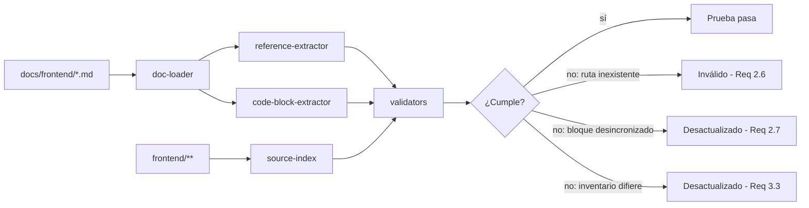

# Documento de Diseño

## Overview

Este diseño define **cómo se produce y se mantiene sincronizada** la `Documentación_Frontend` de VisionHub: un conjunto de nueve documentos Markdown en español, redactados en `Estilo_Harness_Engineer`, que describen exclusivamente el `Frontend_VisionHub` ubicado en `frontend/src` (React 18, TypeScript, Vite, Tailwind CSS, React Router DOM v6, TanStack React Query v5, Zustand, React Hook Form + Zod y Axios). El `Backend` (`backend/`) queda fuera de alcance.

El principio rector es que la documentación es una `Spec_Ejecutable`: cada afirmación técnica se ancla a un artefacto real del frontend mediante una ruta relativa a la raíz del repositorio y, cuando corresponde, al identificador del símbolo que la respalda. Para que la spec sea "ejecutable" y no se degrade con el tiempo, el diseño incorpora un **arnés de validación** (documentation validator) que verifica de forma automatizada un subconjunto de afirmaciones estructurales contra el código fuente: existencia de las rutas referenciadas, correspondencia textual de los bloques de código con su origen, y equivalencia entre los inventarios documentados (directorios, stores, servicios, rutas) y el contenido real del repositorio.

El diseño cubre dos productos complementarios:

1. **El conjunto documental** (`docs/frontend/*.md`): los nueve documentos que cumplen los Requisitos 3–11 más un índice de navegación.
2. **El arnés de validación** (`frontend/src/test/docs/`): el código que convierte los Requisitos 1–2 (alcance, estilo, spec ejecutable) en comprobaciones automatizadas, de modo que un documento con una referencia inexistente o un ejemplo de código desincronizado se marque como inválido o desactualizado (Requisitos 2.6, 2.7, 3.3).

### Objetivos de diseño

- **Trazabilidad total**: cada documento mapea a uno o más requisitos, y cada afirmación verificable mapea a un artefacto de `frontend/`.
- **Verificabilidad**: las afirmaciones estructurales (inventarios, rutas, bloques de código) son comprobables por el arnés sin intervención humana.
- **Alcance acotado**: ninguna referencia sale de `frontend/`, salvo las rutas HTTP y formas de datos que el frontend consume del `Backend` (Requisito 1.3).
- **Idioma**: 100% del contenido textual en español (Requisito 1.5).

### Fuentes de verdad (código real ya inspeccionado)

El diseño se apoya en artefactos existentes verificados durante el análisis:

- Punto de entrada `frontend/src/main.tsx` y raíz `frontend/src/App.tsx` (define `QueryClient`, `PrivateRoute`, `RoleGuard`, `DefaultRoute`).
- Cliente API `frontend/src/services/api.ts` (interceptores, `getErrorMessage`, `shouldShowToast`, refresco de token).
- Stores en `frontend/src/store/` (`auth.store.ts` con `persist` y clave `visionhub-auth`; `ui.store.ts`, `casa-de-paz.store.ts`, `periodo.store.ts`).
- Hook de dominio `frontend/src/hooks/useCalendario.ts` (objeto `calendarioKeys`, `staleTime` de 1 hora y 5 minutos, `invalidateQueries`).
- Formulario de referencia `frontend/src/components/calendario/EventoForm.tsx` (esquema Zod `eventoSchema`, `useForm` con `zodResolver`, `refine` con `path`).
- Constantes `frontend/src/utils/constants.ts` (`ROUTES`, `API_BASE_URL` vía `import.meta.env.VITE_API_URL`).
- Utilidad `frontend/src/utils/cn.ts` (`clsx` + `tailwind-merge`) y `frontend/src/utils/tasa-evangelismo.ts`.
- Prueba de propiedades existente `frontend/src/utils/__tests__/tasa-evangelismo.property.test.ts` y setup `frontend/src/test/setup.ts`.
- Scripts de `frontend/package.json` (`"test": "vitest --run"`) y dependencias declaradas (versiones exactas de cada librería del stack).

## Architecture

### Ubicación y estructura del conjunto documental

Los documentos residen en `docs/frontend/` en la raíz del repositorio. Se elige la raíz (y no `frontend/docs/`) para que las rutas citadas dentro de los documentos se expresen de forma uniforme como rutas relativas a la raíz del repositorio, sin barra inicial (Requisito 2.3), y para separar el material documental del árbol de build de Vite.

```
docs/frontend/
  README.md                     # Índice de navegación y mapa requisito → documento
  01-arquitectura.md            # Requisito 3
  02-componentes.md             # Requisito 4
  03-estado.md                  # Requisito 5
  04-routing.md                 # Requisito 6
  05-formularios.md             # Requisito 7
  06-servicios.md               # Requisito 8
  07-convenciones.md            # Requisito 9
  08-testing.md                 # Requisito 10
  09-flujos-de-datos.md         # Requisito 11
```

Cada documento mapea 1:1 a un requisito de contenido. Los Requisitos 1 (alcance) y 2 (estilo/spec ejecutable) son transversales: se aplican a los nueve documentos y se hacen cumplir mediante el arnés de validación.

### Arquitectura del arnés de validación (Spec Ejecutable)

El arnés vive junto a la suite de pruebas del frontend para reutilizar Vitest y ejecutarse con `npm test`:

```
frontend/src/test/docs/
  doc-loader.ts        # Descubre y parsea los .md de docs/frontend/
  reference-extractor.ts   # Extrae rutas y símbolos referenciados desde el markdown
  code-block-extractor.ts  # Extrae bloques ``` y su ruta de origen citada
  source-index.ts      # Índice del código real de frontend/ (rutas, directorios)
  validators.ts        # Reglas: existencia, coincidencia textual, inventarios
  docs.property.test.ts    # Pruebas de propiedades sobre el conjunto documental
  docs.test.ts         # Pruebas de ejemplo/edge cases
```

Flujo del arnés:



### Convención de anclaje (afirmación → código)

Cada afirmación verificable de la documentación se ancla con uno de estos dos formatos, que el `reference-extractor` reconoce:

- **Referencia de archivo**: una ruta relativa a la raíz, sin barra inicial, entre acentos graves, por ejemplo `frontend/src/services/api.ts`.
- **Referencia de símbolo**: la ruta anterior seguida del identificador del símbolo, por ejemplo `frontend/src/App.tsx` → `RoleGuard`.

Todo bloque de código de ejemplo va precedido o seguido inmediatamente por la ruta de su archivo de origen, para que el `code-block-extractor` pueda emparejar bloque y fuente y verificar coincidencia textual (Requisitos 2.2, 2.7).

### Estilo Harness Engineer (reglas de forma)

- Jerarquía de encabezados estricta H1→H2→H3(→H4), sin saltar niveles, un único H1 por documento (Requisito 2.1).
- Prohibición de calificadores subjetivos ("rápido", "adecuado", "amigable", "eficiente", "intuitivo"); se sustituyen por valores medibles o criterios verificables (Requisito 2.5).
- Todo ejemplo va en bloque delimitado con triple backtick con lenguaje identificado (Requisito 9.6).
- Toda mención al `Backend` se limita a ruta HTTP + forma de request/response (Requisito 1.3).

### Dirección de dependencias documentada

El `Documento_Arquitectura` fija la dirección permitida `pages → components → hooks → services → store`, y declara que el sentido inverso no está permitido (Requisito 3.6). El diseño refleja el código real: `frontend/src/services/api.ts` lee el store (`useAuthStore.getState()`), los hooks (`useCalendario.ts`) invocan servicios, y las páginas consumen hooks.

## Components and Interfaces

### El conjunto documental (nueve documentos)

| Documento | Archivo | Requisito | Contenido ancla (símbolos/artefactos reales) |
|-----------|---------|-----------|-----------------------------------------------|
| Arquitectura | `docs/frontend/01-arquitectura.md` | 3 | 8 directorios de `frontend/src`; stack y versiones de `frontend/package.json`; `main.tsx`, `App.tsx`; flujo de dependencias |
| Componentes | `docs/frontend/02-componentes.md` | 4 | 7 subdirectorios de `frontend/src/components`; 8 componentes `ui`; props; named exports; barriles `index.ts` |
| Estado | `docs/frontend/03-estado.md` | 5 | 4 stores; `persist` + `visionhub-auth` + `partialize`; `QueryClient` (`retry: 1`, `refetchOnWindowFocus: false`); `calendarioKeys`; `staleTime` |
| Routing | `docs/frontend/04-routing.md` | 6 | `ROUTES`; `PrivateRoute`, `RoleGuard`, `DefaultRoute`; mapeo ruta→rol; redirecciones `replace` |
| Formularios | `docs/frontend/05-formularios.md` | 7 | `useForm` + `zodResolver`; `z.infer`; `EventoForm.tsx`; `refine` con `path`; `handleSubmit`; `defaultValues` |
| Servicios | `docs/frontend/06-servicios.md` | 8 | 11 servicios; `api.ts` (`baseURL`, interceptores); refresco 401/`_retry`; `getErrorMessage`; `shouldShowToast` |
| Convenciones | `docs/frontend/07-convenciones.md` | 9 | `frontend/src/types/*.types.ts`; `cn`; idioma español; `import.meta.env`; utilidades de `utils` |
| Testing | `docs/frontend/08-testing.md` | 10 | Vitest (`npm test`, `--run`); Testing Library + `setup.ts`; fast-check + `tasa-evangelismo.property.test.ts`; nomenclatura |
| Flujos de datos | `docs/frontend/09-flujos-de-datos.md` | 11 | Flujos calendario/evangelismo/dashboard; secuencia ida/retorno; propagación de errores |

### Plantilla de documento (estructura común)

Cada documento sigue esta estructura Harness Engineer:

```markdown
# <Título único del documento>            (H1, Req 2.1)

## Propósito y alcance
- Requisito(s) que cubre.
- Delimitación: solo artefactos bajo frontend/ (Req 1.1, 1.2).

## <Secciones temáticas H2>
### <Subsecciones H3>
- Afirmación + ancla: `ruta/relativa` → `simbolo`   (Req 2.4)
- Bloque de código citado con su ruta de origen     (Req 2.2, 2.7)

## Tabla de referencia
| Artefacto | Ruta | Símbolo | ... |
```

### Interfaces del arnés de validación

`doc-loader.ts` — descubre y carga los documentos.

```typescript
export interface LoadedDoc {
  path: string;          // p.ej. "docs/frontend/06-servicios.md"
  content: string;       // contenido markdown completo
}
export function loadDocs(dir: string): LoadedDoc[];
```

`reference-extractor.ts` — extrae referencias de archivo citadas en el markdown.

```typescript
export interface FileReference {
  docPath: string;       // documento que contiene la referencia
  targetPath: string;    // ruta relativa a la raíz, sin barra inicial
  line: number;
}
export function extractFileReferences(doc: LoadedDoc): FileReference[];
```

`code-block-extractor.ts` — extrae bloques de código y su ruta de origen citada.

```typescript
export interface CodeBlockCitation {
  docPath: string;
  sourcePath: string;    // ruta de origen citada junto al bloque
  language: string;      // lenguaje declarado tras los backticks (Req 9.6)
  body: string;          // contenido textual del bloque
}
export function extractCodeBlocks(doc: LoadedDoc): CodeBlockCitation[];
```

`source-index.ts` — inventario del código real del frontend.

```typescript
export interface SourceIndex {
  exists(relativePath: string): boolean;
  read(relativePath: string): string | null;
  listDir(relativePath: string): string[];   // nombres de entradas directas
}
export function buildSourceIndex(repoRoot: string): SourceIndex;
```

`validators.ts` — reglas de la spec ejecutable.

```typescript
export function referencedPathExists(ref: FileReference, idx: SourceIndex): boolean;
export function codeBlockMatchesSource(block: CodeBlockCitation, idx: SourceIndex): boolean;
export function isFrontendScoped(relativePath: string): boolean;   // empieza por "frontend/"
export function directoryInventoryMatches(documented: string[], actual: string[]): boolean;
```

## Data Models

### Modelo de afirmación anclada

Representa la unidad mínima verificable de la spec ejecutable: una afirmación de la documentación vinculada a un artefacto del código.

```typescript
interface AnchoredClaim {
  docPath: string;        // documento origen de la afirmación
  targetPath: string;     // artefacto de frontend/ que la respalda
  symbol?: string;        // identificador de función/componente/hook/constante (Req 2.4)
}
```

### Modelo de cita de bloque de código

```typescript
interface CodeBlockCitation {
  docPath: string;
  sourcePath: string;     // debe existir y empezar por "frontend/"
  language: string;       // "typescript" | "typescriptreact" | "json" | ...
  body: string;           // debe coincidir textualmente con un fragmento del origen
}
```

### Modelo de inventario

Los inventarios documentados que el arnés compara contra la realidad del repositorio:

```typescript
interface Inventory {
  kind: 'directorios-src' | 'subdirectorios-components' | 'stores' | 'servicios' | 'rutas';
  documented: string[];   // lo que el documento enumera
  actual: string[];       // lo derivado de source-index / código real
}
```

Inventarios concretos y su fuente de verdad:

| Inventario | Fuente de verdad | Valor esperado (real) |
|------------|------------------|-----------------------|
| Directorios de `frontend/src` | `source-index.listDir('frontend/src')` | `components`, `hooks`, `pages`, `services`, `store`, `test`, `types`, `utils` |
| Subdirectorios de components | `listDir('frontend/src/components')` | `ui`, `layout`, `shared`, `calendario`, `evangelismo`, `casas-de-paz`, `icons` |
| Componentes `ui` | `listDir('frontend/src/components/ui')` | `button`, `card`, `checkbox`, `input`, `label`, `modal`, `select`, `textarea` |
| Stores | `listDir('frontend/src/store')` | `auth.store`, `casa-de-paz.store`, `periodo.store`, `ui.store` |
| Servicios | `listDir('frontend/src/services')` | 11 servicios + `api` |
| Rutas | objeto `ROUTES` en `frontend/src/utils/constants.ts` | `LOGIN`, `DASHBOARD`, `NUEVO_REPORTE`, `PERSONAS`, `SUBLIDERES`, `EVANGELISMO`, `ASISTENCIAS`, `CALENDARIO` |

### Modelo de estado de documento

Refleja el ciclo de vida de un documento como spec ejecutable (Requisitos 2.6, 2.7, 3.3):

```typescript
type DocStatus = 'valido' | 'invalido' | 'desactualizado';
// 'invalido'       → contiene una ruta referenciada que no existe (Req 2.6)
// 'desactualizado' → un bloque de código no coincide con su origen (Req 2.7)
//                    o un inventario difiere del repositorio (Req 3.3)
```

## Correctness Properties

*Una propiedad es una característica o comportamiento que debe cumplirse en todas las ejecuciones válidas de un sistema; en esencia, una afirmación formal sobre lo que el sistema debe hacer. Las propiedades sirven de puente entre las especificaciones legibles por humanos y las garantías de corrección verificables por máquina.*

En este diseño, el "sistema" verificado por propiedades es el **arnés de validación de la spec ejecutable** operando sobre el conjunto documental (`docs/frontend/*.md`) y el índice del código real (`frontend/**`). Las propiedades formalizan las afirmaciones estructurales de los Requisitos 1–4 y 9 que pueden comprobarse de forma automatizada. Las afirmaciones puramente redaccionales (descripciones, "propósitos", políticas de recomendación) no se modelan como propiedades y se verifican por revisión manual y por coincidencia textual de sus bloques de código (ver Testing Strategy).

### Property 1: Alcance exclusivo de frontend en las referencias

*Para toda* referencia de archivo extraída de cualquier documento de `docs/frontend/`, su ruta objetivo comienza por `frontend/` (las menciones al `Backend` se limitan a rutas HTTP y no constituyen referencias de archivo).

**Validates: Requirements 1.1, 1.2, 1.4**

### Property 2: Toda ruta referenciada existe y usa formato relativo sin barra inicial

*Para toda* referencia de archivo extraída de cualquier documento, la ruta no comienza con `/` y corresponde a un archivo existente en el repositorio; cuando no existe, el documento se clasifica como `invalido`.

**Validates: Requirements 2.3, 2.6, 10.7**

### Property 3: Coincidencia textual de los bloques de código con su origen

*Para todo* bloque de código con ruta de origen citada en cualquier documento, el cuerpo del bloque aparece textualmente en el archivo de origen citado; cuando no coincide, el documento se clasifica como `desactualizado`.

**Validates: Requirements 2.2, 2.7**

### Property 4: Estructura jerárquica de encabezados

*Para todo* documento de `docs/frontend/`, existe exactamente un encabezado H1, ningún encabezado supera el nivel H4, y al recorrer los encabezados en orden ningún nivel incrementa en más de uno respecto del anterior (H1→H2→H3 sin saltos).

**Validates: Requirements 2.1**

### Property 5: Equivalencia de inventarios documentados con el repositorio

*Para todo* inventario declarado en la documentación (directorios de `frontend/src`, subdirectorios de `frontend/src/components`, componentes de `frontend/src/components/ui`, stores de `frontend/src/store`, servicios de `frontend/src/services` y claves del objeto `ROUTES`), el conjunto de nombres documentados es igual al conjunto de nombres reales derivado del código; cuando difieren, el documento se clasifica como `desactualizado`.

**Validates: Requirements 3.1, 3.3, 4.1, 4.3, 5.1, 6.1, 8.1**

### Property 6: Exclusión de archivos de prueba del catálogo de componentes

*Para toda* referencia de componente en el `Documento_Componentes`, la ruta objetivo no termina en `.test.tsx`.

**Validates: Requirements 4.2**

### Property 7: Correspondencia entre símbolos documentados y exports reales

*Para todo* componente o símbolo documentado con su identificador exportado (incluidos los re-exportados por un `index.ts` de barril), el archivo de origen contiene un export nombrado con ese identificador, y el conjunto de símbolos re-exportados documentados para un barril es igual al conjunto real de re-exports de ese barril.

**Validates: Requirements 4.5, 4.6**

### Property 8: Todos los bloques de código declaran lenguaje

*Para todo* bloque de código delimitado con triple backtick en cualquier documento, el identificador de lenguaje declarado tras los backticks de apertura no está vacío.

**Validates: Requirements 9.6**

### Property 9: Nomenclatura de archivos de tipos

*Para toda* referencia a un archivo ubicado bajo `frontend/src/types` en la documentación, el nombre del archivo cumple el patrón `*.types.ts`.

**Validates: Requirements 9.1**

## Error Handling

El arnés y los documentos tratan las desviaciones como estados explícitos, alineados con los Requisitos 2.6, 2.7 y 3.3.

| Condición detectada | Requisito | Estado resultante | Acción del arnés |
|---------------------|-----------|-------------------|------------------|
| Ruta referenciada inexistente | 2.6 | `invalido` | La prueba de la Propiedad 2 falla e identifica documento, línea y ruta objetivo. |
| Ruta con barra inicial o fuera de `frontend/` | 1.1, 1.2, 2.3 | `invalido` | Falla la Propiedad 1 o 2, señalando la referencia infractora. |
| Bloque de código desincronizado con su origen | 2.7 | `desactualizado` | Falla la Propiedad 3, mostrando ruta de origen y el fragmento no encontrado. |
| Inventario documentado distinto del real | 3.3 | `desactualizado` | Falla la Propiedad 5, mostrando la diferencia de conjuntos (faltantes/sobrantes). |
| Archivo `.test.tsx` listado como componente | 4.2 | `desactualizado` | Falla la Propiedad 6, señalando la entrada infractora. |
| Bloque de código sin lenguaje declarado | 9.6 | `desactualizado` | Falla la Propiedad 8. |

Comportamiento del arnés ante entradas límite:

- **Conjunto documental vacío o documento sin bloques de código**: las propiedades cuantificadas universalmente se satisfacen de forma vacua; no se reporta error.
- **Ruta de origen citada que no existe**: se trata primero como violación de la Propiedad 2 (existencia) antes de evaluar coincidencia textual, para dar un mensaje de error preciso.
- **Referencias a rutas HTTP del `Backend`** (por ejemplo `/auth/refresh`): el `reference-extractor` las clasifica como endpoints HTTP, no como referencias de archivo, por lo que quedan excluidas de las Propiedades 1 y 2 (Requisito 1.3).

Los documentos, a su vez, describen el manejo de errores del `Frontend_VisionHub` real (no del arnés) citando el código: la cadena de propagación `Cliente_API → Servicio_HTTP → Hook_Dominio → UI` (Requisito 11.6), la función `getErrorMessage` de `frontend/src/services/api.ts` con su tabla de códigos HTTP, y la supresión de notificaciones vía `shouldShowToast`.

## Testing Strategy

### Enfoque dual

- **Pruebas de propiedades** (fast-check): verifican las nueve propiedades universales sobre el conjunto documental y el índice de código. Son el mecanismo que mantiene la spec ejecutable sincronizada con `frontend/`.
- **Pruebas de ejemplo** (Vitest + Testing Library cuando aplique): verifican casos concretos y de contenido que no son universales (por ejemplo, que el `Documento_Servicios` cite `getErrorMessage` con los códigos 400–503, o que el `Documento_Testing` cite un fragmento real de `tasa-evangelismo.property.test.ts`).
- **Revisión manual**: cubre las afirmaciones redaccionales no computables (idioma español integral 1.5, descripciones de propósito, políticas de recomendación de testing 10.5/10.6, mapeos descriptivos de routing y flujos de datos).

### Aplicabilidad de PBT

El arnés de validación es código con entradas y salidas claras (documentos y código → veredicto), con afirmaciones universales del tipo "para toda referencia/bloque/inventario…". Por eso las Propiedades 1–9 se implementan como pruebas basadas en propiedades. En cambio, la redacción del contenido documental no es una función pura y se valida por ejemplo/manual.

### Herramientas y convenciones

- Ejecutor: **Vitest**, invocado con `npm test` (script `"test": "vitest --run"` de `frontend/package.json`).
- Setup global: `frontend/src/test/setup.ts` (registra matchers de `@testing-library/jest-dom`).
- Librería de propiedades: **fast-check** (ya presente en `devDependencies`). No se implementa PBT desde cero.
- Ubicación de las pruebas del arnés: `frontend/src/test/docs/docs.property.test.ts` (propiedades) y `frontend/src/test/docs/docs.test.ts` (ejemplos/edge cases).
- Configuración: cada prueba de propiedad ejecuta como mínimo **100 iteraciones** (`{ numRuns: 100 }`), consistente con `frontend/src/utils/__tests__/tasa-evangelismo.property.test.ts`.
- Etiquetado: cada prueba de propiedad incluye un comentario con el formato **Feature: documentacion-frontend, Property {número}: {texto de la propiedad}** y la referencia al requisito validado.

### Generación de entradas

Las propiedades se prueban sobre inputs derivados del conjunto documental real (referencias, bloques, encabezados, inventarios extraídos). Para reforzar la robustez del arnés, los generadores de fast-check producen además:

- Rutas sintéticas dentro y fuera de `frontend/` (para Propiedades 1 y 2).
- Bloques de código coincidentes y deliberadamente alterados respecto del origen (para Propiedad 3).
- Secuencias de niveles de encabezado válidas e inválidas, incluyendo saltos de nivel y múltiples H1 (para Propiedad 4).
- Inventarios con elementos faltantes y sobrantes respecto del conjunto real (para Propiedad 5).
- Nombres de archivo con y sin sufijo `.test.tsx` y con y sin patrón `*.types.ts` (para Propiedades 6 y 9).

### Mapa propiedad → prueba

| Propiedad | Requisitos | Archivo de prueba |
|-----------|------------|-------------------|
| 1 Alcance frontend/ | 1.1, 1.2, 1.4 | `frontend/src/test/docs/docs.property.test.ts` |
| 2 Existencia y formato de rutas | 2.3, 2.6, 10.7 | `frontend/src/test/docs/docs.property.test.ts` |
| 3 Coincidencia textual de bloques | 2.2, 2.7 | `frontend/src/test/docs/docs.property.test.ts` |
| 4 Estructura de encabezados | 2.1 | `frontend/src/test/docs/docs.property.test.ts` |
| 5 Equivalencia de inventarios | 3.1, 3.3, 4.1, 4.3, 5.1, 6.1, 8.1 | `frontend/src/test/docs/docs.property.test.ts` |
| 6 Exclusión de .test.tsx | 4.2 | `frontend/src/test/docs/docs.property.test.ts` |
| 7 Símbolos vs exports | 4.5, 4.6 | `frontend/src/test/docs/docs.property.test.ts` |
| 8 Lenguaje en bloques | 9.6 | `frontend/src/test/docs/docs.property.test.ts` |
| 9 Nomenclatura *.types.ts | 9.1 | `frontend/src/test/docs/docs.property.test.ts` |

### Cobertura de ejemplo y edge cases (no propiedades)

- **Sin calificadores subjetivos** (2.5): prueba de ejemplo que verifica ausencia de la lista fija de términos prohibidos en cada documento.
- **Versiones del stack** (3.4): prueba de ejemplo que compara las versiones documentadas con las declaradas en `frontend/package.json`.
- **Comando de test y bandera `--run`** (10.1): prueba de ejemplo sobre el script `test` de `frontend/package.json`.
- **Anclaje de afirmaciones de comportamiento** (2.4) e **idioma español** (1.5): checklist de revisión manual.
