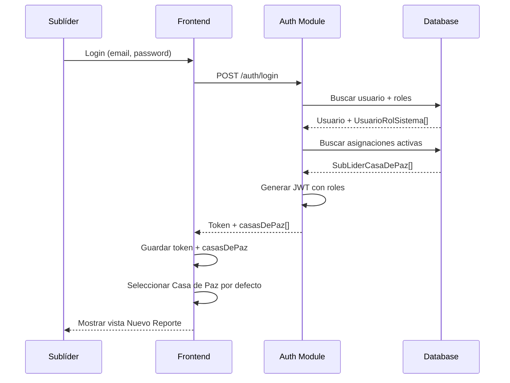
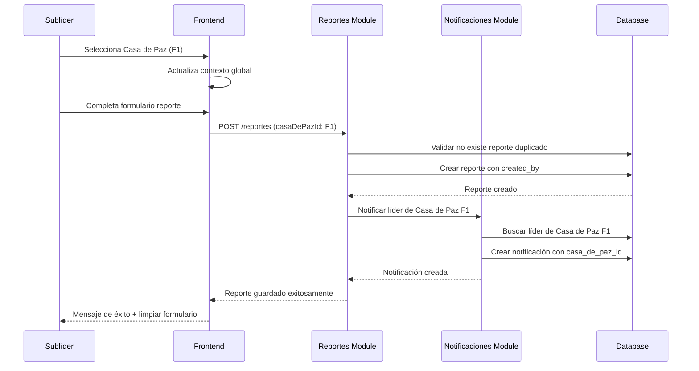

# Diseño: Gestión de Sublíderes

## Overview

Este diseño implementa un sistema completo de gestión de sublíderes para Casas de Paz, permitiendo a los líderes delegar responsabilidades de reporte a miembros de confianza. El sistema soporta multi-tenancy a nivel de Casa de Paz, donde un sublíder puede estar asignado a múltiples Casas de Paz (misma red o diferentes redes) y cada Casa de Paz mantiene su propio contexto independiente.

### Características Principales

- Asignación de sublíderes con generación automática de credenciales
- Vista simplificada para sublíderes (solo 2 módulos: Nuevo Reporte y Personas)
- Selector de Casa de Paz en header para sublíderes con múltiples asignaciones
- Sistema de notificaciones específicas por Casa de Paz
- Control granular de permisos (habilitar/deshabilitar acceso por Casa de Paz)
- Códigos de Casa de Paz en header (F1, VN7, etc.)
- Auditoría completa de acciones del sublíder

### Alcance

El sistema cubre:
- Backend: Módulos de sublíderes, notificaciones, autenticación extendida
- Frontend: Páginas de gestión, layout de sublíder, selector de Casa de Paz, notificaciones
- Base de datos: Uso de tablas existentes (sub_lider_casa_de_paz, estado_sub_lider, notificacion)
- Seguridad: Guards de autorización, validación de contexto de Casa de Paz

## Architecture

### Arquitectura General

El sistema sigue una arquitectura de tres capas con separación clara de responsabilidades:

```
┌─────────────────────────────────────────────────────────────┐
│                      Frontend (React)                        │
│  ┌──────────────┐  ┌──────────────┐  ┌──────────────┐      │
│  │ Líder Layout │  │Sublíder Layout│  │   Shared     │      │
│  │              │  │ (Simplified)  │  │  Components  │      │
│  └──────────────┘  └──────────────┘  └──────────────┘      │
│         │                  │                  │              │
│         └──────────────────┴──────────────────┘              │
│                            │                                 │
│                    ┌───────▼────────┐                        │
│                    │  API Services  │                        │
│                    └───────┬────────┘                        │
└────────────────────────────┼──────────────────────────────────┘
                             │ HTTP/REST
┌────────────────────────────▼──────────────────────────────────┐
│                    Backend (NestJS)                           │
│  ┌──────────────┐  ┌──────────────┐  ┌──────────────┐       │
│  │    Auth      │  │  Sublíderes  │  │Notificaciones│       │
│  │   Module     │  │    Module    │  │    Module    │       │
│  └──────┬───────┘  └──────┬───────┘  └──────┬───────┘       │
│         │                  │                  │               │
│         └──────────────────┴──────────────────┘               │
│                            │                                  │
│                    ┌───────▼────────┐                         │
│                    │ Prisma Service │                         │
│                    └───────┬────────┘                         │
└────────────────────────────┼───────────────────────────────────┘
                             │
┌────────────────────────────▼───────────────────────────────────┐
│                    PostgreSQL Database                         │
│  ┌──────────────┐  ┌──────────────┐  ┌──────────────┐        │
│  │   usuario    │  │sub_lider_cdp │  │ notificacion │        │
│  └──────────────┘  └──────────────┘  └──────────────┘        │
└────────────────────────────────────────────────────────────────┘
```


### Flujo de Autenticación Multi-Casa de Paz



### Flujo de Creación de Reporte con Notificación



### Patrón de Multi-Tenancy

El sistema implementa multi-tenancy a nivel de Casa de Paz:

- Cada sublíder puede tener múltiples asignaciones (SubLiderCasaDePaz)
- Cada asignación es independiente con su propio estado (activo/inactivo/suspendido)
- El contexto de Casa de Paz se mantiene en el frontend (localStorage + estado global)
- Todas las operaciones incluyen `casa_de_paz_id` para filtrado
- Las notificaciones son específicas por Casa de Paz


## Components and Interfaces

### Backend Components

#### 1. Sublíderes Module

**Responsabilidad**: Gestión completa del ciclo de vida de sublíderes

**Endpoints**:
```typescript
// Obtener miembros disponibles para asignar
GET /api/sublideres/miembros-disponibles?casaDePazId={id}
Response: Persona[]

// Asignar sublíder
POST /api/sublideres/asignar
Body: {
  personaId: number;
  casaDePazId: number;
  fechaInicio: Date;
  estadoSubLiderId: number; // activo
}
Response: {
  sublider: SubLiderCasaDePaz;
  credenciales: {
    username: string;
    password: string;
    email: string;
  }
}

// Remover sublíder
POST /api/sublideres/:id/remover
Body: {
  fechaFin: Date;
  motivo?: string;
}
Response: { success: boolean }

// Cambiar estado de acceso
PATCH /api/sublideres/:id/estado
Body: {
  estadoSubLiderId: number; // activo/inactivo/suspendido
}
Response: SubLiderCasaDePaz

// Obtener sublíder activo de una Casa de Paz
GET /api/sublideres/activo?casaDePazId={id}
Response: SubLiderCasaDePaz | null

// Obtener historial de sublíderes
GET /api/sublideres/historial?casaDePazId={id}
Response: SubLiderCasaDePaz[]

// Obtener asignaciones de un sublíder (para selector)
GET /api/sublideres/mis-casas-de-paz
Response: {
  id: number;
  casaDePaz: {
    id: number;
    codigo: string;
    red: { nombre: string };
    lider: { nombre: string };
  };
  estado: { estado: string };
}[]
```

**Servicios**:
```typescript
class SubLideresService {
  // Generar credenciales automáticas
  async generarCredenciales(persona: Persona): Promise<{
    username: string;
    password: string;
    email: string;
  }>;
  
  // Asignar sublíder y crear usuario
  async asignarSublider(dto: AsignarSubliderDto): Promise<{
    sublider: SubLiderCasaDePaz;
    credenciales: Credenciales;
  }>;
  
  // Validar que no exista sublíder activo
  async validarNoExisteSubliderActivo(casaDePazId: number): Promise<void>;
  
  // Obtener asignaciones activas de un sublíder
  async obtenerAsignacionesActivas(personaId: number): Promise<SubLiderCasaDePaz[]>;
}
```


#### 2. Notificaciones Module

**Responsabilidad**: Gestión de notificaciones específicas por Casa de Paz

**Endpoints**:
```typescript
// Obtener notificaciones del líder
GET /api/notificaciones?casaDePazId={id}
Response: Notificacion[]

// Marcar notificación como leída
PATCH /api/notificaciones/:id/leer
Response: Notificacion

// Marcar todas como leídas
PATCH /api/notificaciones/leer-todas?casaDePazId={id}
Response: { count: number }

// Obtener contador de no leídas
GET /api/notificaciones/contador?casaDePazId={id}
Response: { count: number }
```

**Servicios**:
```typescript
class NotificacionesService {
  // Crear notificación para líder de Casa de Paz
  async notificarLider(params: {
    casaDePazId: number;
    tipo: string;
    mensaje: string;
    metadata?: any;
  }): Promise<Notificacion>;
  
  // Obtener notificaciones del líder
  async obtenerNotificaciones(
    liderUsuarioId: number,
    casaDePazId: number
  ): Promise<Notificacion[]>;
}
```

**Tabla Notificacion** (nueva):
```prisma
model Notificacion {
  id              Int       @id @default(autoincrement())
  usuarioId       Int       @map("usuario_id")
  casaDePazId     Int       @map("casa_de_paz_id")
  tipo            String
  mensaje         String
  metadata        Json?
  leida           Boolean   @default(false)
  leidaAt         DateTime? @map("leida_at")
  createdAt       DateTime  @default(now()) @map("created_at")
  
  usuario         Usuario   @relation(fields: [usuarioId], references: [id])
  casaDePaz       CasaDePaz @relation(fields: [casaDePazId], references: [id])
  
  @@index([usuarioId, casaDePazId, leida])
  @@map("notificacion")
}
```


#### 3. Auth Module (Extensión)

**Cambios necesarios**:

```typescript
// Extender LoginResponseDto
interface LoginResponseDto {
  accessToken: string;
  refreshToken: string;
  user: {
    id: number;
    email: string;
    username: string;
    personaId: number;
    casaDePazId?: number; // Para líder
    casasDePaz?: CasaDePazAsignacion[]; // Para sublíder
    requiereCambioPassword: boolean;
  };
}

interface CasaDePazAsignacion {
  id: number;
  codigo: string;
  redNombre: string;
  liderNombre: string;
  estadoAcceso: string;
}

// Extender JwtStrategy.validate()
async validate(payload: any) {
  const usuario = await this.prisma.usuario.findUnique({
    where: { id: payload.sub },
    include: {
      roles: {
        where: { deletedAt: null },
        include: {
          rol: true,
          casaDePaz: true,
        },
      },
    },
  });
  
  // Si es sublíder, cargar sus asignaciones
  let casasDePaz = [];
  const esSublider = usuario.roles.some(r => r.rol.nombre === 'SUBLIDER_CDP');
  
  if (esSublider) {
    casasDePaz = await this.prisma.subLiderCasaDePaz.findMany({
      where: {
        personaId: usuario.personaId,
        fechaFin: null,
        deletedAt: null,
      },
      include: {
        casaDePaz: {
          include: {
            red: true,
            lider: true,
          },
        },
        estado: true,
      },
    });
  }
  
  return {
    userId: usuario.id,
    personaId: usuario.personaId,
    roles: usuario.roles,
    casasDePaz: casasDePaz.map(cdp => ({
      id: cdp.casaDePazId,
      codigo: cdp.casaDePaz.codigo,
      redNombre: cdp.casaDePaz.red.nombre,
      liderNombre: `${cdp.casaDePaz.lider.primerNombre} ${cdp.casaDePaz.lider.primerApellido}`,
      estadoAcceso: cdp.estado.estado,
    })),
  };
}
```

**Nuevo Guard**: `CasaDePazContextGuard`
```typescript
@Injectable()
export class CasaDePazContextGuard implements CanActivate {
  canActivate(context: ExecutionContext): boolean {
    const request = context.switchToHttp().getRequest();
    const user = request.user;
    const casaDePazId = request.body.casaDePazId || request.query.casaDePazId;
    
    // Validar que el usuario tenga acceso a esta Casa de Paz
    const tieneAcceso = user.casasDePaz?.some(
      cdp => cdp.id === casaDePazId && cdp.estadoAcceso === 'activo'
    );
    
    if (!tieneAcceso) {
      throw new ForbiddenException('No tienes acceso a esta Casa de Paz');
    }
    
    return true;
  }
}
```


#### 4. Casas de Paz Module (Extensión)

**Cambios en CasasDePazService**:

```typescript
class CasasDePazService {
  // Obtener código de Casa de Paz
  async obtenerCodigo(casaDePazId: number): Promise<string> {
    const casaDePaz = await this.prisma.casaDePaz.findUnique({
      where: { id: casaDePazId },
      select: { codigo: true },
    });
    return casaDePaz?.codigo;
  }
  
  // Obtener líder de Casa de Paz
  async obtenerLider(casaDePazId: number): Promise<Usuario> {
    const casaDePaz = await this.prisma.casaDePaz.findUnique({
      where: { id: casaDePazId },
      include: {
        lider: {
          include: { usuarios: true },
        },
      },
    });
    return casaDePaz?.lider.usuarios[0];
  }
}
```

**Cambios en ReportesController**:

```typescript
@Post()
@UseGuards(JwtAuthGuard, RolesGuard, CasaDePazContextGuard)
@Roles('LIDER_CDP', 'SUBLIDER_CDP')
async crearReporte(
  @Body() dto: CrearReporteDto,
  @Request() req,
) {
  // Validar que no exista reporte duplicado
  await this.reportesService.validarNoDuplicado(
    dto.casaDePazId,
    dto.fechaReunion
  );
  
  // Crear reporte
  const reporte = await this.reportesService.crear({
    ...dto,
    createdBy: req.user.userId,
  });
  
  // Si es sublíder, notificar al líder
  const esSublider = req.user.roles.some(r => r.rolNombre === 'SUBLIDER_CDP');
  if (esSublider) {
    await this.notificacionesService.notificarLider({
      casaDePazId: dto.casaDePazId,
      tipo: 'REPORTE_SUBLIDER',
      mensaje: `Reporte creado por sublíder - Reunión del ${dto.fechaReunion}`,
      metadata: { reporteId: reporte.id },
    });
  }
  
  return reporte;
}
```


### Frontend Components

#### 1. GestionSublideres Page (Líder)

**Ubicación**: `frontend/src/pages/GestionSublideres.tsx`

**Responsabilidad**: Página principal para gestionar sublíderes

**Componentes**:
```typescript
interface GestionSublideresProps {}

const GestionSublideres: React.FC = () => {
  const [subliderActivo, setSubliderActivo] = useState<SubLider | null>(null);
  const [historial, setHistorial] = useState<SubLider[]>([]);
  const [miembrosDisponibles, setMiembrosDisponibles] = useState<Persona[]>([]);
  const [mostrarModalAsignar, setMostrarModalAsignar] = useState(false);
  const [credencialesGeneradas, setCredencialesGeneradas] = useState<Credenciales | null>(null);
  
  // Cargar sublíder activo y historial
  useEffect(() => {
    cargarDatos();
  }, []);
  
  const handleAsignar = async (personaId: number) => {
    const resultado = await sublideresService.asignar({
      personaId,
      casaDePazId: authStore.casaDePazId,
      fechaInicio: new Date(),
      estadoSubLiderId: ESTADO_ACTIVO_ID,
    });
    
    setCredencialesGeneradas(resultado.credenciales);
    setMostrarModalAsignar(false);
    cargarDatos();
  };
  
  const handleRemover = async (motivo?: string) => {
    await sublideresService.remover(subliderActivo.id, {
      fechaFin: new Date(),
      motivo,
    });
    cargarDatos();
  };
  
  const handleCambiarEstado = async (estadoId: number) => {
    await sublideresService.cambiarEstado(subliderActivo.id, estadoId);
    cargarDatos();
  };
  
  return (
    <div>
      {/* Sección: Sublíder Activo */}
      {subliderActivo ? (
        <SubliderActivoCard
          sublider={subliderActivo}
          onRemover={handleRemover}
          onCambiarEstado={handleCambiarEstado}
        />
      ) : (
        <BotonAsignarSublider onClick={() => setMostrarModalAsignar(true)} />
      )}
      
      {/* Sección: Historial */}
      <HistorialSublideresTable historial={historial} />
      
      {/* Modal: Asignar Sublíder */}
      <ModalAsignarSublider
        open={mostrarModalAsignar}
        miembros={miembrosDisponibles}
        onAsignar={handleAsignar}
        onClose={() => setMostrarModalAsignar(false)}
      />
      
      {/* Modal: Credenciales Generadas */}
      <ModalCredenciales
        open={!!credencialesGeneradas}
        credenciales={credencialesGeneradas}
        onClose={() => setCredencialesGeneradas(null)}
      />
    </div>
  );
};
```


#### 2. Sublíder Layout

**Ubicación**: `frontend/src/components/layout/SubliderLayout.tsx`

**Responsabilidad**: Layout simplificado para sublíderes (sin dashboard)

**Estructura**:
```typescript
const SubliderLayout: React.FC = () => {
  const navigate = useNavigate();
  const { user, logout } = useAuthStore();
  const { casaDePazActual, setCasaDePaz } = useCasaDePazStore();
  
  useEffect(() => {
    // Redirigir a Nuevo Reporte por defecto
    if (location.pathname === '/') {
      navigate('/nuevo-reporte');
    }
  }, []);
  
  return (
    <div className="flex h-screen">
      {/* Sidebar simplificado */}
      <aside className="w-64 bg-gray-800">
        <nav>
          <NavLink to="/nuevo-reporte">Nuevo Reporte</NavLink>
          <NavLink to="/personas">Personas</NavLink>
          <button onClick={logout}>Cerrar Sesión</button>
        </nav>
      </aside>
      
      {/* Main content */}
      <div className="flex-1 flex flex-col">
        {/* Header con selector de Casa de Paz */}
        <header className="bg-white shadow">
          <CasaDePazSelector
            casasDePaz={user.casasDePaz}
            casaActual={casaDePazActual}
            onChange={setCasaDePaz}
          />
        </header>
        
        <main className="flex-1 overflow-auto p-6">
          <Outlet />
        </main>
      </div>
    </div>
  );
};
```

#### 3. Casa de Paz Selector

**Ubicación**: `frontend/src/components/shared/CasaDePazSelector.tsx`

**Responsabilidad**: Selector de Casa de Paz en header para sublíderes

```typescript
interface CasaDePazSelectorProps {
  casasDePaz: CasaDePazAsignacion[];
  casaActual: CasaDePazAsignacion;
  onChange: (casa: CasaDePazAsignacion) => void;
}

const CasaDePazSelector: React.FC<CasaDePazSelectorProps> = ({
  casasDePaz,
  casaActual,
  onChange,
}) => {
  const [open, setOpen] = useState(false);
  
  // Si solo tiene una Casa de Paz, mostrar código estático
  if (casasDePaz.length === 1) {
    return (
      <div className="flex items-center gap-2">
        <span className="font-bold text-lg">{casaActual.codigo}</span>
        <span className="text-sm text-gray-600">{casaActual.redNombre}</span>
      </div>
    );
  }
  
  // Si tiene múltiples, mostrar dropdown
  return (
    <DropdownMenu open={open} onOpenChange={setOpen}>
      <DropdownMenuTrigger>
        <div className="flex items-center gap-2 cursor-pointer">
          <span className="font-bold text-lg">{casaActual.codigo}</span>
          <ChevronDown className="w-4 h-4" />
        </div>
      </DropdownMenuTrigger>
      
      <DropdownMenuContent>
        {casasDePaz.map((casa) => (
          <DropdownMenuItem
            key={casa.id}
            onClick={() => onChange(casa)}
            disabled={casa.estadoAcceso !== 'activo'}
          >
            <div className="flex flex-col">
              <span className="font-semibold">{casa.codigo}</span>
              <span className="text-sm text-gray-600">{casa.redNombre}</span>
              <span className="text-xs text-gray-500">Líder: {casa.liderNombre}</span>
              {casa.estadoAcceso !== 'activo' && (
                <span className="text-xs text-red-500">Acceso deshabilitado</span>
              )}
            </div>
          </DropdownMenuItem>
        ))}
      </DropdownMenuContent>
    </DropdownMenu>
  );
};
```


#### 4. Sistema de Notificaciones

**Ubicación**: `frontend/src/components/shared/NotificacionesBell.tsx`

**Responsabilidad**: Icono de notificaciones en header del líder

```typescript
const NotificacionesBell: React.FC = () => {
  const [notificaciones, setNotificaciones] = useState<Notificacion[]>([]);
  const [contador, setContador] = useState(0);
  const [open, setOpen] = useState(false);
  const { casaDePazId } = useAuthStore();
  
  useEffect(() => {
    cargarNotificaciones();
    // Polling cada 30 segundos
    const interval = setInterval(cargarNotificaciones, 30000);
    return () => clearInterval(interval);
  }, [casaDePazId]);
  
  const cargarNotificaciones = async () => {
    const data = await notificacionesService.obtener(casaDePazId);
    setNotificaciones(data);
    setContador(data.filter(n => !n.leida).length);
  };
  
  const handleMarcarLeida = async (id: number) => {
    await notificacionesService.marcarLeida(id);
    cargarNotificaciones();
  };
  
  const handleMarcarTodasLeidas = async () => {
    await notificacionesService.marcarTodasLeidas(casaDePazId);
    cargarNotificaciones();
  };
  
  return (
    <DropdownMenu open={open} onOpenChange={setOpen}>
      <DropdownMenuTrigger>
        <div className="relative">
          <Bell className="w-6 h-6" />
          {contador > 0 && (
            <span className="absolute -top-1 -right-1 bg-red-500 text-white text-xs rounded-full w-5 h-5 flex items-center justify-center">
              {contador}
            </span>
          )}
        </div>
      </DropdownMenuTrigger>
      
      <DropdownMenuContent className="w-80">
        <div className="flex justify-between items-center p-2 border-b">
          <span className="font-semibold">Notificaciones</span>
          {contador > 0 && (
            <button
              onClick={handleMarcarTodasLeidas}
              className="text-sm text-blue-600"
            >
              Marcar todas como leídas
            </button>
          )}
        </div>
        
        <div className="max-h-96 overflow-y-auto">
          {notificaciones.length === 0 ? (
            <div className="p-4 text-center text-gray-500">
              No hay notificaciones
            </div>
          ) : (
            notificaciones.map((notif) => (
              <NotificacionItem
                key={notif.id}
                notificacion={notif}
                onMarcarLeida={handleMarcarLeida}
              />
            ))
          )}
        </div>
      </DropdownMenuContent>
    </DropdownMenu>
  );
};
```


#### 5. Stores (Zustand)

**Casa de Paz Store**:
```typescript
// frontend/src/store/casa-de-paz.store.ts
interface CasaDePazStore {
  casaDePazActual: CasaDePazAsignacion | null;
  casasDePaz: CasaDePazAsignacion[];
  setCasaDePaz: (casa: CasaDePazAsignacion) => void;
  setCasasDePaz: (casas: CasaDePazAsignacion[]) => void;
  cargarDesdeLocalStorage: () => void;
}

export const useCasaDePazStore = create<CasaDePazStore>((set) => ({
  casaDePazActual: null,
  casasDePaz: [],
  
  setCasaDePaz: (casa) => {
    localStorage.setItem('casaDePazActual', JSON.stringify(casa));
    set({ casaDePazActual: casa });
  },
  
  setCasasDePaz: (casas) => {
    set({ casasDePaz: casas });
    // Seleccionar primera por defecto si no hay selección
    const actual = localStorage.getItem('casaDePazActual');
    if (!actual && casas.length > 0) {
      const primera = casas.sort((a, b) => a.codigo.localeCompare(b.codigo))[0];
      set({ casaDePazActual: primera });
      localStorage.setItem('casaDePazActual', JSON.stringify(primera));
    }
  },
  
  cargarDesdeLocalStorage: () => {
    const actual = localStorage.getItem('casaDePazActual');
    if (actual) {
      set({ casaDePazActual: JSON.parse(actual) });
    }
  },
}));
```

**Auth Store (Extensión)**:
```typescript
// Agregar a frontend/src/store/auth.store.ts
interface AuthStore {
  // ... campos existentes
  casasDePaz: CasaDePazAsignacion[];
  
  login: (email: string, password: string) => Promise<void>;
  // ... otros métodos
}

// En el método login:
const response = await authService.login(email, password);
set({
  user: response.user,
  token: response.accessToken,
  casasDePaz: response.user.casasDePaz || [],
});

// Si es sublíder, cargar casas de paz en el store
if (response.user.casasDePaz?.length > 0) {
  useCasaDePazStore.getState().setCasasDePaz(response.user.casasDePaz);
}
```


## Data Models

### Database Schema Changes

#### Nueva Tabla: Notificacion

```prisma
model Notificacion {
  id              Int       @id @default(autoincrement())
  usuarioId       Int       @map("usuario_id")
  casaDePazId     Int       @map("casa_de_paz_id")
  tipo            String    // 'REPORTE_SUBLIDER', 'CAMBIO_ESTADO', etc.
  mensaje         String
  metadata        Json?     // { reporteId, subliderNombre, etc. }
  leida           Boolean   @default(false)
  leidaAt         DateTime? @map("leida_at")
  createdAt       DateTime  @default(now()) @map("created_at")
  
  usuario         Usuario   @relation(fields: [usuarioId], references: [id])
  casaDePaz       CasaDePaz @relation(fields: [casaDePazId], references: [id])
  
  @@index([usuarioId, casaDePazId, leida])
  @@map("notificacion")
}
```

#### Nuevo Rol: SUBLIDER_CDP

```sql
INSERT INTO rol_sistema (nombre, descripcion, scope)
VALUES ('SUBLIDER_CDP', 'Sublíder de Casa de Paz', 'casa_de_paz');
```

#### Tablas Existentes (Sin Cambios)

Las siguientes tablas ya existen y se usarán sin modificaciones:

- `sub_lider_casa_de_paz`: Almacena asignaciones de sublíderes
- `estado_sub_lider`: Estados (activo, inactivo, suspendido)
- `usuario`: Credenciales de acceso
- `usuario_rol_sistema`: Asignación de roles con casa_de_paz_id
- `casa_de_paz`: Tiene campo `codigo` para mostrar en header
- `casa_de_paz_reporte`: Tiene `created_by` para auditoría

### DTOs

#### Backend DTOs

```typescript
// AsignarSubliderDto
export class AsignarSubliderDto {
  @IsNumber()
  personaId: number;
  
  @IsNumber()
  casaDePazId: number;
  
  @IsDateString()
  fechaInicio: Date;
  
  @IsNumber()
  estadoSubLiderId: number;
}

// RemoverSubliderDto
export class RemoverSubliderDto {
  @IsDateString()
  fechaFin: Date;
  
  @IsOptional()
  @IsString()
  motivo?: string;
}

// CambiarEstadoSubliderDto
export class CambiarEstadoSubliderDto {
  @IsNumber()
  estadoSubLiderId: number;
}

// CrearNotificacionDto
export class CrearNotificacionDto {
  @IsNumber()
  casaDePazId: number;
  
  @IsString()
  tipo: string;
  
  @IsString()
  mensaje: string;
  
  @IsOptional()
  metadata?: any;
}
```


#### Frontend Types

```typescript
// types/sublider.types.ts
export interface SubLider {
  id: number;
  casaDePazId: number;
  personaId: number;
  persona: {
    primerNombre: string;
    primerApellido: string;
    correoElectronico?: string;
  };
  fechaInicio: Date;
  fechaFin?: Date;
  estado: {
    id: number;
    estado: string;
  };
  observaciones?: string;
}

export interface Credenciales {
  username: string;
  password: string;
  email: string;
}

export interface CasaDePazAsignacion {
  id: number;
  codigo: string;
  redNombre: string;
  liderNombre: string;
  estadoAcceso: 'activo' | 'inactivo' | 'suspendido';
}

// types/notificacion.types.ts
export interface Notificacion {
  id: number;
  tipo: string;
  mensaje: string;
  metadata?: {
    reporteId?: number;
    subliderNombre?: string;
    codigoCasaDePaz?: string;
  };
  leida: boolean;
  leidaAt?: Date;
  createdAt: Date;
}
```

### Reglas de Negocio en Modelos

#### Generación de Username

```typescript
// Algoritmo de generación de username
function generarUsername(persona: Persona): string {
  const base = `sublider.${persona.primerNombre}.${persona.primerApellido}`
    .toLowerCase()
    .normalize('NFD')
    .replace(/[\u0300-\u036f]/g, '') // Remover acentos
    .replace(/\s+/g, '');
  
  // Verificar si existe
  let username = base;
  let contador = 2;
  
  while (await existeUsername(username)) {
    username = `${base}.${contador}`;
    contador++;
  }
  
  return username;
}
```

#### Generación de Password Temporal

```typescript
function generarPasswordTemporal(): string {
  const mayusculas = 'ABCDEFGHIJKLMNOPQRSTUVWXYZ';
  const minusculas = 'abcdefghijklmnopqrstuvwxyz';
  const numeros = '0123456789';
  const especiales = '!@#$%^&*';
  
  const todos = mayusculas + minusculas + numeros + especiales;
  
  let password = '';
  password += mayusculas[Math.floor(Math.random() * mayusculas.length)];
  password += minusculas[Math.floor(Math.random() * minusculas.length)];
  password += numeros[Math.floor(Math.random() * numeros.length)];
  password += especiales[Math.floor(Math.random() * especiales.length)];
  
  for (let i = 4; i < 12; i++) {
    password += todos[Math.floor(Math.random() * todos.length)];
  }
  
  // Mezclar caracteres
  return password.split('').sort(() => Math.random() - 0.5).join('');
}
```

#### Validación de Código de Casa de Paz

```typescript
// El código se genera automáticamente: [Red_Initials][Number]
// Ejemplos: F1, F2, VN7, VN8
// Formato: 1-3 letras mayúsculas + 1-3 números
const CODIGO_REGEX = /^[A-Z]{1,3}\d{1,3}$/;

function validarCodigo(codigo: string): boolean {
  return CODIGO_REGEX.test(codigo);
}
```


## Correctness Properties

A property is a characteristic or behavior that should hold true across all valid executions of a system—essentially, a formal statement about what the system should do. Properties serve as the bridge between human-readable specifications and machine-verifiable correctness guarantees.

### Property Reflection

After analyzing all acceptance criteria, the following redundancies were identified and consolidated:

- RF-001.5 (reuse credentials) is redundant with RF-001.4 (create credentials only first time) - both test the same behavior from different angles
- RF-008.3 (notification to specific líder) is redundant with RF-007.4 (same requirement)
- Multiple audit trail properties (RF-001.6, RF-002.5, RF-003.5, RF-006.7, RF-007.2) can be consolidated into a single comprehensive audit property
- State change properties (RF-003.1, RF-003.4) can be combined into one property about immediate state persistence
- Access control properties for disabled Casa de Paz (RF-005B.6, RF-007.7) can be combined

The following properties represent the unique, non-redundant validation requirements:

### Property 1: Active Member Selection

For any Casa de Paz and any set of members, when querying available members for sublíder assignment, the system should return only members with active SSVA status.

**Validates: Requirements RF-001.1**

### Property 2: Multiple Casa de Paz Assignments

For any person and any set of Casas de Paz (same or different networks), the system should allow creating multiple SubLiderCasaDePaz assignments for that person, and all assignments should persist independently.

**Validates: Requirements RF-001.2**

### Property 3: Assignment Required Fields

For any sublíder assignment attempt, if any required field (personaId, casaDePazId, fechaInicio, estadoSubLiderId) is missing, the system should reject the assignment.

**Validates: Requirements RF-001.3**

### Property 4: Credential Generation on First Assignment

For any person being assigned as sublíder, if they have no existing usuario record, the system should create credentials (username, email, password); if they already have a usuario record from another Casa de Paz assignment, the system should reuse those credentials.

**Validates: Requirements RF-001.4, RF-001.5**

### Property 5: Comprehensive Audit Trail

For any sublíder operation (assignment, removal, state change, persona creation, reporte creation), the system should record the user who performed the action (created_by or updated_by) and the timestamp (created_at or updated_at).

**Validates: Requirements RF-001.6, RF-002.5, RF-003.5, RF-006.7, RF-007.2**

### Property 6: Removal Required Fields

For any sublíder removal attempt, if fechaFin is not provided, the system should reject the removal.

**Validates: Requirements RF-002.2**

### Property 7: Immediate Access Revocation

For any sublíder removal, immediately after the removal operation completes, any login attempt with that sublíder's credentials should fail with unauthorized error.

**Validates: Requirements RF-002.3**

### Property 8: Reporte Preservation After Removal

For any sublíder with existing reportes, after removing that sublíder, all their reportes should still exist in the database with the same created_by value.

**Validates: Requirements RF-002.4**

### Property 9: State Change Persistence

For any sublíder and any valid estado change, after changing the estado, querying the sublíder record should immediately reflect the new estado value.

**Validates: Requirements RF-003.1, RF-003.4**

### Property 10: Disabled Access Prevention

For any sublíder with estado "inactivo" or "suspendido", any login attempt should fail with a specific error message indicating access is disabled.

**Validates: Requirements RF-003.2**

### Property 11: Enabled Access Permission

For any sublíder with estado "activo", login attempts should succeed and reporte creation should be allowed.

**Validates: Requirements RF-003.3**

### Property 12: Credential Format Validation

For any generated credentials, the username should match pattern "sublider.{nombre}.{apellido}" (with numeric suffix if duplicate), the email should be valid format, and the password should contain at least 8 characters with uppercase, lowercase, number, and special character.

**Validates: Requirements RF-004.1**

### Property 13: Usuario Record Creation

For any sublíder assignment, the system should create a usuario record with personaId, isActive=true, and requiereCambioPassword=true.

**Validates: Requirements RF-004.2**

### Property 14: Role Assignment with Casa de Paz Context

For any sublíder assignment, the system should create a UsuarioRolSistema record with rolSistemaId for "SUBLIDER_CDP", the correct casaDePazId, and fechaInicio.

**Validates: Requirements RF-004.3**

### Property 15: Password Change Requirement Flag

For any login with requiereCambioPassword=true, the system should return a flag indicating password change is required before full access is granted.

**Validates: Requirements RF-004.5**

### Property 16: Restricted Module Access

For any sublíder attempting to access restricted endpoints (dashboard, evangelismo, gestion-sublideres, historial-asistencias, estadisticas), the system should reject the request with forbidden error.

**Validates: Requirements RF-005.4**

### Property 17: Disabled Casa de Paz Access Prevention

For any sublíder with a Casa de Paz assignment where estadoAcceso is not "activo", any operation (reporte creation, persona query) specifying that casaDePazId should be rejected.

**Validates: Requirements RF-005B.6, RF-007.7**

### Property 18: Casa de Paz Data Isolation

For any sublíder querying personas, the system should return only personas where cdp_membresia.casa_de_paz_id matches the specified casaDePazId in the request.

**Validates: Requirements RF-006.2, RF-006.6**

### Property 19: Reporte Casa de Paz Association

For any reporte created by a sublíder, the reporte record should have casa_de_paz_id matching the casaDePazId specified in the creation request.

**Validates: Requirements RF-007.3**

### Property 20: Targeted Notification Creation

For any reporte created by a sublíder in a specific Casa de Paz, the system should create exactly one notification record with usuarioId of the líder of that Casa de Paz and casaDePazId matching the reporte's Casa de Paz.

**Validates: Requirements RF-007.4, RF-008.3**

### Property 21: Persona Selection Filtering

For any sublíder creating a reporte, the available personas for selection should only include personas from the current Casa de Paz (matching casaDePazId).

**Validates: Requirements RF-007.6**

### Property 22: Future Date Validation

For any reporte creation attempt with fechaReunion in the future, the system should reject the creation.

**Validates: Requirements RF-007.8**

### Property 23: Duplicate Reporte Prevention

For any Casa de Paz and any date, if a reporte already exists with that casa_de_paz_id and fechaReunion, attempting to create another reporte with the same casa_de_paz_id and fechaReunion should be rejected.

**Validates: Requirements RF-007.9**

### Property 24: Notification Multi-Tenancy Isolation

For any sublíder creating reportes in multiple Casas de Paz, each notification should be associated only with the líder of the specific Casa de Paz where the reporte was created, and líderes should not receive notifications for other Casas de Paz.

**Validates: Requirements RF-008.4**

### Property 25: Notification Read State Update

For any notification marked as leída, the notification record should have leida=true and leidaAt populated with the current timestamp.

**Validates: Requirements RF-008.7**

### Property 26: Notification Ordering

For any query of notifications, the results should be ordered by createdAt in descending order (most recent first).

**Validates: Requirements RF-008.8**

### Property 27: Bulk Mark as Read

For any líder marking all notifications as leída for a specific Casa de Paz, all notification records with that casaDePazId and leida=false should be updated to leida=true.

**Validates: Requirements RF-008.9**

### Property 28: Reporte Filtering by Creator

For any Casa de Paz, when filtering reportes by creator (all, only líder, only sublíder), the system should return only reportes matching the filter criteria based on created_by field.

**Validates: Requirements RF-008.12**

### Property 29: Historial Filtering by Estado

For any Casa de Paz, when filtering sublíder historial by estado (all, activos, removidos), the system should return only SubLiderCasaDePaz records matching the filter criteria.

**Validates: Requirements RF-009.3**

### Property 30: Historial Ordering

For any query of sublíder historial, the results should be ordered by fechaInicio in descending order (most recent first).

**Validates: Requirements RF-009.4**

### Property 31: Forced Password Change on First Login

For any usuario with requiereCambioPassword=true, any attempt to access protected resources (other than password change endpoint) should be rejected until password is changed.

**Validates: Requirements RF-010.1**

### Property 32: Password Policy Validation

For any password change attempt, if the new password does not meet the policy (minimum 8 characters, at least one uppercase, one lowercase, one number, one special character), the system should reject the change.

**Validates: Requirements RF-010.3**

### Property 33: Password Change State Update

For any successful password change, the usuario record should be updated with requiereCambioPassword=false and ultimo_cambio_password_at set to the current timestamp.

**Validates: Requirements RF-010.4, RF-010.5**


## Error Handling

### Error Categories

#### 1. Validation Errors (400 Bad Request)

```typescript
// Missing required fields
{
  statusCode: 400,
  message: 'Validation failed',
  errors: [
    { field: 'personaId', message: 'personaId is required' },
    { field: 'casaDePazId', message: 'casaDePazId is required' }
  ]
}

// Invalid data format
{
  statusCode: 400,
  message: 'fechaReunion cannot be in the future'
}

// Duplicate reporte
{
  statusCode: 400,
  message: 'Ya existe un reporte para esta fecha en F1'
}

// Weak password
{
  statusCode: 400,
  message: 'Password must contain at least 8 characters, including uppercase, lowercase, number, and special character'
}
```

#### 2. Authentication Errors (401 Unauthorized)

```typescript
// Invalid credentials
{
  statusCode: 401,
  message: 'Credenciales inválidas'
}

// Disabled access
{
  statusCode: 401,
  message: 'Tu acceso ha sido temporalmente deshabilitado. Contacta al líder.'
}

// Locked account
{
  statusCode: 401,
  message: 'Usuario bloqueado por múltiples intentos fallidos'
}

// Password change required
{
  statusCode: 401,
  message: 'Debes cambiar tu contraseña antes de continuar',
  requiereCambioPassword: true
}
```

#### 3. Authorization Errors (403 Forbidden)

```typescript
// No access to Casa de Paz
{
  statusCode: 403,
  message: 'No tienes acceso a esta Casa de Paz'
}

// Restricted module
{
  statusCode: 403,
  message: 'No tienes permisos para acceder a este módulo'
}

// Cannot edit sublíder's reporte
{
  statusCode: 403,
  message: 'No puedes editar reportes creados por el sublíder'
}
```

#### 4. Not Found Errors (404 Not Found)

```typescript
// Sublíder not found
{
  statusCode: 404,
  message: 'Sublíder no encontrado'
}

// Casa de Paz not found
{
  statusCode: 404,
  message: 'Casa de Paz no encontrada'
}

// Notification not found
{
  statusCode: 404,
  message: 'Notificación no encontrada'
}
```

#### 5. Conflict Errors (409 Conflict)

```typescript
// Sublíder already exists
{
  statusCode: 409,
  message: 'Ya existe un sublíder activo para esta Casa de Paz'
}

// Username already exists
{
  statusCode: 409,
  message: 'El username ya está en uso'
}
```

### Error Handling Strategy

#### Backend Error Handling

```typescript
// Global exception filter
@Catch()
export class AllExceptionsFilter implements ExceptionFilter {
  catch(exception: unknown, host: ArgumentsHost) {
    const ctx = host.switchToHttp();
    const response = ctx.getResponse();
    const request = ctx.getRequest();
    
    let status = 500;
    let message = 'Internal server error';
    
    if (exception instanceof HttpException) {
      status = exception.getStatus();
      message = exception.message;
    } else if (exception instanceof PrismaClientKnownRequestError) {
      // Handle Prisma errors
      if (exception.code === 'P2002') {
        status = 409;
        message = 'Registro duplicado';
      } else if (exception.code === 'P2025') {
        status = 404;
        message = 'Registro no encontrado';
      }
    }
    
    // Log error
    console.error({
      timestamp: new Date().toISOString(),
      path: request.url,
      method: request.method,
      status,
      message,
      stack: exception instanceof Error ? exception.stack : undefined,
    });
    
    response.status(status).json({
      statusCode: status,
      message,
      timestamp: new Date().toISOString(),
      path: request.url,
    });
  }
}
```

#### Frontend Error Handling

```typescript
// API service error interceptor
api.interceptors.response.use(
  (response) => response,
  (error) => {
    const status = error.response?.status;
    const message = error.response?.data?.message || 'Error desconocido';
    
    // Handle specific errors
    if (status === 401) {
      if (error.response?.data?.requiereCambioPassword) {
        // Redirect to password change
        window.location.href = '/cambiar-password';
      } else {
        // Logout and redirect to login
        authStore.logout();
        window.location.href = '/login';
      }
    } else if (status === 403) {
      toast.error(message);
    } else if (status === 404) {
      toast.error(message);
    } else if (status === 409) {
      toast.error(message);
    } else if (status >= 500) {
      toast.error('Error del servidor. Por favor intenta más tarde.');
    }
    
    return Promise.reject(error);
  }
);
```

### Logging and Monitoring

```typescript
// Audit log for sublíder actions
interface AuditLog {
  timestamp: Date;
  userId: number;
  action: string; // 'ASSIGN_SUBLIDER', 'REMOVE_SUBLIDER', 'CREATE_REPORTE', etc.
  casaDePazId: number;
  metadata: any;
  ipAddress: string;
  userAgent: string;
}

// Log sublíder actions
async logAction(params: {
  userId: number;
  action: string;
  casaDePazId: number;
  metadata?: any;
  request: Request;
}) {
  await this.prisma.auditLog.create({
    data: {
      timestamp: new Date(),
      userId: params.userId,
      action: params.action,
      casaDePazId: params.casaDePazId,
      metadata: params.metadata,
      ipAddress: params.request.ip,
      userAgent: params.request.headers['user-agent'],
    },
  });
}
```


## Testing Strategy

### Dual Testing Approach

This feature requires both unit tests and property-based tests for comprehensive coverage:

- **Unit tests**: Verify specific examples, edge cases, and error conditions
- **Property tests**: Verify universal properties across all inputs

Both approaches are complementary and necessary. Unit tests catch concrete bugs in specific scenarios, while property tests verify general correctness across a wide range of inputs.

### Property-Based Testing

#### Library Selection

- **Backend (NestJS/TypeScript)**: Use `fast-check` library
- **Frontend (React/TypeScript)**: Use `fast-check` library

#### Configuration

Each property test must:
- Run minimum 100 iterations (due to randomization)
- Reference its design document property in a comment
- Use the tag format: `Feature: gestion-sublider, Property {number}: {property_text}`

#### Example Property Test

```typescript
import fc from 'fast-check';

describe('SubLideresService - Property Tests', () => {
  /**
   * Feature: gestion-sublider, Property 2: Multiple Casa de Paz Assignments
   * For any person and any set of Casas de Paz (same or different networks),
   * the system should allow creating multiple SubLiderCasaDePaz assignments
   * for that person, and all assignments should persist independently.
   */
  it('should allow multiple Casa de Paz assignments for same person', async () => {
    await fc.assert(
      fc.asyncProperty(
        fc.integer({ min: 1, max: 1000 }), // personaId
        fc.array(fc.integer({ min: 1, max: 100 }), { minLength: 2, maxLength: 5 }), // casaDePazIds
        async (personaId, casaDePazIds) => {
          // Setup: Create persona and Casas de Paz
          const persona = await createTestPersona(personaId);
          const casasDePaz = await Promise.all(
            casaDePazIds.map(id => createTestCasaDePaz(id))
          );
          
          // Action: Assign sublíder to all Casas de Paz
          const assignments = await Promise.all(
            casasDePaz.map(cdp =>
              sublideresService.asignarSublider({
                personaId: persona.id,
                casaDePazId: cdp.id,
                fechaInicio: new Date(),
                estadoSubLiderId: ESTADO_ACTIVO_ID,
              })
            )
          );
          
          // Assert: All assignments exist independently
          expect(assignments).toHaveLength(casasDePaz.length);
          
          for (const assignment of assignments) {
            const found = await prisma.subLiderCasaDePaz.findUnique({
              where: { id: assignment.sublider.id },
            });
            expect(found).toBeDefined();
            expect(found.personaId).toBe(persona.id);
          }
          
          // Cleanup
          await cleanupTestData(persona.id, casaDePazIds);
        }
      ),
      { numRuns: 100 }
    );
  });
  
  /**
   * Feature: gestion-sublider, Property 12: Credential Format Validation
   * For any generated credentials, the username should match pattern
   * "sublider.{nombre}.{apellido}" (with numeric suffix if duplicate),
   * the email should be valid format, and the password should contain
   * at least 8 characters with uppercase, lowercase, number, and special character.
   */
  it('should generate credentials matching required format', async () => {
    await fc.assert(
      fc.asyncProperty(
        fc.record({
          primerNombre: fc.string({ minLength: 3, maxLength: 20 }),
          primerApellido: fc.string({ minLength: 3, maxLength: 20 }),
        }),
        async (persona) => {
          // Action: Generate credentials
          const credenciales = await sublideresService.generarCredenciales(persona);
          
          // Assert: Username format
          const usernameRegex = /^sublider\.[a-z]+\.[a-z]+(\.\d+)?$/;
          expect(credenciales.username).toMatch(usernameRegex);
          
          // Assert: Email format
          const emailRegex = /^[^\s@]+@[^\s@]+\.[^\s@]+$/;
          expect(credenciales.email).toMatch(emailRegex);
          
          // Assert: Password complexity
          expect(credenciales.password).toHaveLength(12);
          expect(credenciales.password).toMatch(/[A-Z]/); // Uppercase
          expect(credenciales.password).toMatch(/[a-z]/); // Lowercase
          expect(credenciales.password).toMatch(/[0-9]/); // Number
          expect(credenciales.password).toMatch(/[!@#$%^&*]/); // Special
        }
      ),
      { numRuns: 100 }
    );
  });
});
```

### Unit Testing

#### Backend Unit Tests

```typescript
describe('SubLideresService - Unit Tests', () => {
  describe('asignarSublider', () => {
    it('should reject assignment if sublíder already exists', async () => {
      // Setup: Create existing sublíder
      const existingSublider = await createTestSublider({
        casaDePazId: 1,
        personaId: 1,
      });
      
      // Action & Assert
      await expect(
        sublideresService.asignarSublider({
          personaId: 2,
          casaDePazId: 1,
          fechaInicio: new Date(),
          estadoSubLiderId: ESTADO_ACTIVO_ID,
        })
      ).rejects.toThrow('Ya existe un sublíder activo para esta Casa de Paz');
    });
    
    it('should create usuario only on first assignment', async () => {
      // Setup
      const persona = await createTestPersona();
      
      // Action: First assignment
      const result1 = await sublideresService.asignarSublider({
        personaId: persona.id,
        casaDePazId: 1,
        fechaInicio: new Date(),
        estadoSubLiderId: ESTADO_ACTIVO_ID,
      });
      
      const usuario1 = await prisma.usuario.findFirst({
        where: { personaId: persona.id },
      });
      
      // Action: Second assignment
      const result2 = await sublideresService.asignarSublider({
        personaId: persona.id,
        casaDePazId: 2,
        fechaInicio: new Date(),
        estadoSubLiderId: ESTADO_ACTIVO_ID,
      });
      
      const usuario2 = await prisma.usuario.findFirst({
        where: { personaId: persona.id },
      });
      
      // Assert: Same usuario for both assignments
      expect(usuario1.id).toBe(usuario2.id);
      expect(result1.credenciales).toBeDefined();
      expect(result2.credenciales).toBeNull(); // No new credentials
    });
  });
  
  describe('removerSublider', () => {
    it('should preserve reportes after removal', async () => {
      // Setup: Create sublíder and reportes
      const sublider = await createTestSublider();
      const reportes = await createTestReportes(sublider.id, 3);
      
      // Action: Remove sublíder
      await sublideresService.removerSublider(sublider.id, {
        fechaFin: new Date(),
        motivo: 'Test removal',
      });
      
      // Assert: Reportes still exist
      const reportesAfter = await prisma.casaDePazReporte.findMany({
        where: { createdBy: sublider.usuarioId },
      });
      
      expect(reportesAfter).toHaveLength(3);
    });
  });
});

describe('NotificacionesService - Unit Tests', () => {
  it('should create notification for correct líder', async () => {
    // Setup
    const casaDePaz = await createTestCasaDePaz();
    const lider = await createTestLider(casaDePaz.id);
    const sublider = await createTestSublider({ casaDePazId: casaDePaz.id });
    
    // Action: Create reporte as sublíder
    const reporte = await reportesService.crear({
      casaDePazId: casaDePaz.id,
      fechaReunion: new Date(),
      createdBy: sublider.usuarioId,
    });
    
    // Assert: Notification created for líder
    const notificacion = await prisma.notificacion.findFirst({
      where: {
        usuarioId: lider.usuarioId,
        casaDePazId: casaDePaz.id,
      },
    });
    
    expect(notificacion).toBeDefined();
    expect(notificacion.tipo).toBe('REPORTE_SUBLIDER');
    expect(notificacion.metadata.reporteId).toBe(reporte.id);
  });
});
```

#### Frontend Unit Tests

```typescript
describe('CasaDePazSelector', () => {
  it('should show static code when only one Casa de Paz', () => {
    const casasDePaz = [
      { id: 1, codigo: 'F1', redNombre: 'Fares', liderNombre: 'Juan Pérez', estadoAcceso: 'activo' }
    ];
    
    render(
      <CasaDePazSelector
        casasDePaz={casasDePaz}
        casaActual={casasDePaz[0]}
        onChange={jest.fn()}
      />
    );
    
    expect(screen.getByText('F1')).toBeInTheDocument();
    expect(screen.queryByRole('button')).not.toBeInTheDocument();
  });
  
  it('should show dropdown when multiple Casas de Paz', () => {
    const casasDePaz = [
      { id: 1, codigo: 'F1', redNombre: 'Fares', liderNombre: 'Juan Pérez', estadoAcceso: 'activo' },
      { id: 2, codigo: 'VN7', redNombre: 'Visión Nueva', liderNombre: 'María García', estadoAcceso: 'activo' }
    ];
    
    render(
      <CasaDePazSelector
        casasDePaz={casasDePaz}
        casaActual={casasDePaz[0]}
        onChange={jest.fn()}
      />
    );
    
    const trigger = screen.getByRole('button');
    expect(trigger).toBeInTheDocument();
    
    fireEvent.click(trigger);
    
    expect(screen.getByText('VN7')).toBeInTheDocument();
  });
  
  it('should disable selection of deshabilitada Casa de Paz', () => {
    const casasDePaz = [
      { id: 1, codigo: 'F1', redNombre: 'Fares', liderNombre: 'Juan Pérez', estadoAcceso: 'activo' },
      { id: 2, codigo: 'VN7', redNombre: 'Visión Nueva', liderNombre: 'María García', estadoAcceso: 'inactivo' }
    ];
    
    const onChange = jest.fn();
    
    render(
      <CasaDePazSelector
        casasDePaz={casasDePaz}
        casaActual={casasDePaz[0]}
        onChange={onChange}
      />
    );
    
    fireEvent.click(screen.getByRole('button'));
    
    const inactivaOption = screen.getByText('VN7').closest('div');
    fireEvent.click(inactivaOption);
    
    expect(onChange).not.toHaveBeenCalled();
  });
});
```

### Integration Tests

```typescript
describe('Sublíder Flow - Integration Tests', () => {
  it('should complete full sublíder lifecycle', async () => {
    // 1. Líder assigns sublíder
    const assignResponse = await request(app.getHttpServer())
      .post('/api/sublideres/asignar')
      .set('Authorization', `Bearer ${liderToken}`)
      .send({
        personaId: 1,
        casaDePazId: 1,
        fechaInicio: new Date(),
        estadoSubLiderId: ESTADO_ACTIVO_ID,
      })
      .expect(201);
    
    const { credenciales } = assignResponse.body;
    
    // 2. Sublíder logs in with temporary password
    const loginResponse = await request(app.getHttpServer())
      .post('/api/auth/login')
      .send({
        email: credenciales.email,
        password: credenciales.password,
      })
      .expect(200);
    
    expect(loginResponse.body.user.requiereCambioPassword).toBe(true);
    
    // 3. Sublíder changes password
    await request(app.getHttpServer())
      .post('/api/auth/cambiar-password')
      .set('Authorization', `Bearer ${loginResponse.body.accessToken}`)
      .send({
        passwordActual: credenciales.password,
        nuevoPassword: 'NewSecure123!',
        confirmarPassword: 'NewSecure123!',
      })
      .expect(200);
    
    // 4. Sublíder creates reporte
    const reporteResponse = await request(app.getHttpServer())
      .post('/api/reportes')
      .set('Authorization', `Bearer ${loginResponse.body.accessToken}`)
      .send({
        casaDePazId: 1,
        fechaReunion: new Date(),
        casaDePazTemaId: 1,
        disertadorId: 1,
        ofrendaTotal: 100,
        diezmoTotal: 50,
        salioEvangelizar: true,
        cantidadPersonasEvangelizadas: 2,
        cantAsistentesRegulares: 10,
        cantAsistentesNuevos: 2,
        cantAsistentesNinos: 3,
      })
      .expect(201);
    
    // 5. Líder receives notification
    const notificacionesResponse = await request(app.getHttpServer())
      .get('/api/notificaciones?casaDePazId=1')
      .set('Authorization', `Bearer ${liderToken}`)
      .expect(200);
    
    expect(notificacionesResponse.body).toHaveLength(1);
    expect(notificacionesResponse.body[0].tipo).toBe('REPORTE_SUBLIDER');
    
    // 6. Líder removes sublíder
    await request(app.getHttpServer())
      .post(`/api/sublideres/${assignResponse.body.sublider.id}/remover`)
      .set('Authorization', `Bearer ${liderToken}`)
      .send({
        fechaFin: new Date(),
        motivo: 'Test completion',
      })
      .expect(200);
    
    // 7. Sublíder cannot login after removal
    await request(app.getHttpServer())
      .post('/api/auth/login')
      .send({
        email: credenciales.email,
        password: 'NewSecure123!',
      })
      .expect(401);
  });
});
```

### Test Coverage Goals

- **Backend**: Minimum 80% code coverage
- **Frontend**: Minimum 70% code coverage
- **Property Tests**: All 33 properties must have corresponding tests
- **Integration Tests**: Cover all critical user flows

### Continuous Integration

```yaml
# .github/workflows/test.yml
name: Tests

on: [push, pull_request]

jobs:
  test:
    runs-on: ubuntu-latest
    
    steps:
      - uses: actions/checkout@v2
      
      - name: Setup Node.js
        uses: actions/setup-node@v2
        with:
          node-version: '18'
      
      - name: Install dependencies
        run: |
          cd backend && npm install
          cd ../frontend && npm install
      
      - name: Run backend tests
        run: cd backend && npm run test:cov
      
      - name: Run frontend tests
        run: cd frontend && npm run test:cov
      
      - name: Run property tests
        run: |
          cd backend && npm run test:property
          cd ../frontend && npm run test:property
      
      - name: Upload coverage
        uses: codecov/codecov-action@v2
```

