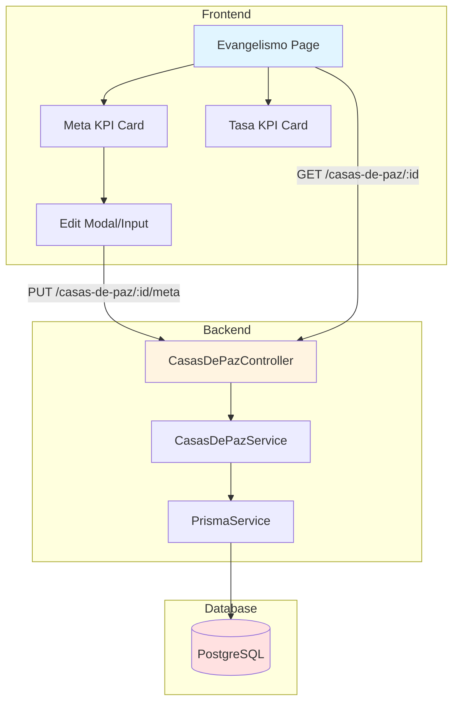

# Design Document: Meta de Evangelismo KPI

## Overview

This feature replaces the existing "Conversiones" and "Tasa de Conversión" KPI cards in the Evangelismo module with new "Meta de Evangelismo" and "Tasa de Evangelismo" cards. The líder can set and edit an evangelism goal for their casa de paz, and the system calculates the evangelism rate as a percentage of the goal achieved.

The implementation involves:
- Database schema extension to store evangelism goals
- Backend API endpoints for CRUD operations on evangelism goals
- Frontend UI modifications to replace KPI cards with editable goal cards
- Authorization controls ensuring only líderes can edit goals
- Calculation logic for the evangelism rate

## Architecture

### System Components



### Data Flow

1. **Read Flow**: Frontend requests casa de paz data → Backend retrieves from database including meta_evangelismo → Frontend displays in KPI cards
2. **Write Flow**: Líder edits meta → Frontend validates input → Backend validates authorization → Database updates meta_evangelismo → Frontend refreshes display

### Technology Stack

- **Database**: PostgreSQL with Prisma ORM
- **Backend**: NestJS with TypeScript
- **Frontend**: React with TypeScript, Zustand for state management
- **UI Components**: Custom card components with Lucide icons

## Components and Interfaces

### Database Schema Changes

#### Prisma Schema Extension

```prisma
model CasaDePaz {
  id                Int      @id @default(autoincrement())
  codigo            String   @unique
  liderId           Int      @map("lider_id")
  redId             Int      @map("red_id")
  ubicacion         String?
  ubicacionGps      String?  @map("ubicacion_gps")
  estadoCdpRedId    Int      @map("estado_cdp_red_id")
  observaciones     String?
  metaEvangelismo   Int?     @map("meta_evangelismo")  // NEW FIELD
  createdAt         DateTime @default(now()) @map("created_at")
  updatedAt         DateTime @updatedAt @map("updated_at")
  // ... existing relations
  
  @@map("casa_de_paz")
}
```

#### Migration File

```sql
-- Migration: add_meta_evangelismo_to_casa_de_paz
ALTER TABLE casa_de_paz 
ADD COLUMN meta_evangelismo INTEGER NULL;

COMMENT ON COLUMN casa_de_paz.meta_evangelismo IS 'Evangelism goal set by the líder';
```

### Backend API Design

#### DTOs

```typescript
// dto/update-meta-evangelismo.dto.ts
export class UpdateMetaEvangelismoDto {
  @IsOptional()
  @IsInt()
  @Min(0)
  @ApiProperty({ 
    description: 'Evangelism goal (null to clear)', 
    required: false,
    minimum: 0,
    nullable: true
  })
  metaEvangelismo: number | null;
}
```

#### Controller Endpoints

```typescript
// casas-de-paz.controller.ts
@Patch(':id/meta-evangelismo')
@ApiOperation({ summary: 'Update evangelism goal for a casa de paz' })
@ApiResponse({ status: 200, description: 'Meta updated successfully' })
@ApiResponse({ status: 403, description: 'Forbidden - user is not the líder' })
@ApiResponse({ status: 404, description: 'Casa de paz not found' })
async updateMetaEvangelismo(
  @Param('id', ParseIntPipe) id: number,
  @Body() updateDto: UpdateMetaEvangelismoDto,
  @Request() req,
) {
  return this.casasDePazService.updateMetaEvangelismo(
    id, 
    updateDto.metaEvangelismo, 
    req.user.id
  );
}
```

#### Service Methods

```typescript
// casas-de-paz.service.ts
async updateMetaEvangelismo(
  casaDePazId: number, 
  metaEvangelismo: number | null, 
  userId: number
): Promise<CasaDePaz> {
  // 1. Verify casa de paz exists
  const casaDePaz = await this.prisma.casaDePaz.findUnique({
    where: { id: casaDePazId },
    include: { lider: true }
  });
  
  if (!casaDePaz) {
    throw new NotFoundException('Casa de paz no encontrada');
  }
  
  // 2. Verify user is the líder
  const usuarioRol = await this.prisma.usuarioRolSistema.findFirst({
    where: {
      usuarioId: userId,
      casaDePazId: casaDePazId,
      rol: { nombre: 'lider' },
      fechaFin: null,
      deletedAt: null
    }
  });
  
  if (!usuarioRol) {
    throw new ForbiddenException('Solo el líder puede actualizar la meta de evangelismo');
  }
  
  // 3. Validate meta value
  if (metaEvangelismo !== null && metaEvangelismo < 0) {
    throw new BadRequestException('La meta debe ser un número positivo o null');
  }
  
  // 4. Update meta
  return this.prisma.casaDePaz.update({
    where: { id: casaDePazId },
    data: { 
      metaEvangelismo,
      updatedBy: userId
    },
    include: {
      lider: true,
      red: true,
      estado: true
    }
  });
}
```

The existing `findOne` method already includes all casa de paz fields, so it will automatically return the new `metaEvangelismo` field without modification.

### Frontend Component Design

#### Type Definitions

```typescript
// types/casa-de-paz.types.ts
export interface CasaDePaz {
  id: number;
  codigo: string;
  liderId: number;
  redId: number;
  ubicacion?: string;
  ubicacionGps?: string;
  estadoCdpRedId: number;
  observaciones?: string;
  metaEvangelismo?: number | null;  // NEW FIELD
  lider: {
    id: number;
    nombreCompleto: string;
  };
  red: {
    id: number;
    nombre: string;
  };
}

// types/dashboard.types.ts
export interface EvangelismoStats {
  total_personas_evangelizadas: number;
  total_conversiones: number;
  meta_evangelismo?: number | null;  // NEW FIELD
  tasa_evangelismo?: number | null;  // NEW FIELD (calculated)
  timeline: Array<{
    fecha: Date;
    personas_evangelizadas: number;
    conversiones: number;
  }>;
}
```

#### Service Methods

```typescript
// services/casas-de-paz.service.ts
export const casasDePazService = {
  // ... existing methods
  
  async updateMetaEvangelismo(
    casaDePazId: number, 
    metaEvangelismo: number | null
  ): Promise<CasaDePaz> {
    const response = await api.patch<CasaDePaz>(
      `/casas-de-paz/${casaDePazId}/meta-evangelismo`,
      { metaEvangelismo }
    );
    return response.data;
  }
};
```

#### UI Components

##### Meta de Evangelismo Card

```typescript
// Component structure for Meta KPI Card
interface MetaCardProps {
  metaEvangelismo: number | null;
  isLider: boolean;
  onUpdate: (newMeta: number | null) => Promise<void>;
}

// Features:
// - Display current meta or "Sin meta"
// - Edit button (visible only to líder)
// - Inline edit mode with input validation
// - Save/Cancel buttons
// - Error handling and loading states
```

##### Tasa de Evangelismo Card

```typescript
// Component structure for Tasa KPI Card
interface TasaCardProps {
  evangelizados: number;
  metaEvangelismo: number | null;
}

// Calculation logic:
// - If meta is null or 0: display "Sin meta"
// - Otherwise: display (evangelizados / meta) * 100 rounded to 2 decimals
// - Format: "XX.XX%"
```

#### Page Modifications

The `Evangelismo.tsx` page will be modified to:
1. Fetch casa de paz data to get `metaEvangelismo` and líder status
2. Replace the "Conversiones" card with "Meta de Evangelismo" card
3. Replace the "Tasa de Conversión" card with "Tasa de Evangelismo" card
4. Keep the "Evangelizados" card in its current position
5. Implement edit functionality for the meta card

### State Management

```typescript
// The page will manage local state for:
// - metaEvangelismo: number | null
// - isEditing: boolean
// - editValue: string
// - isLider: boolean (from auth store)

// Update flow:
// 1. User clicks edit → isEditing = true
// 2. User enters value → editValue updated
// 3. User clicks save → validate → API call → update local state
// 4. User clicks cancel → isEditing = false, discard editValue
```

## Data Models

### Database Model

```typescript
// Prisma generated type
interface CasaDePaz {
  id: number;
  codigo: string;
  liderId: number;
  redId: number;
  ubicacion: string | null;
  ubicacionGps: string | null;
  estadoCdpRedId: number;
  observaciones: string | null;
  metaEvangelismo: number | null;  // NEW
  createdAt: Date;
  updatedAt: Date;
  createdBy: number | null;
  updatedBy: number | null;
  deletedAt: Date | null;
  deletedBy: number | null;
}
```

### API Response Models

```typescript
// GET /casas-de-paz/:id response
interface CasaDePazResponse {
  id: number;
  codigo: string;
  liderId: number;
  redId: number;
  ubicacion?: string;
  ubicacionGps?: string;
  estadoCdpRedId: number;
  observaciones?: string;
  metaEvangelismo?: number | null;
  lider: {
    id: number;
    primerNombre: string;
    primerApellido: string;
    // ... other persona fields
  };
  red: {
    id: number;
    nombre: string;
  };
  estado: {
    id: number;
    estado: string;
  };
}

// PATCH /casas-de-paz/:id/meta-evangelismo request
interface UpdateMetaRequest {
  metaEvangelismo: number | null;
}

// PATCH /casas-de-paz/:id/meta-evangelismo response
// Returns the same structure as GET /casas-de-paz/:id
```

### Frontend State Models

```typescript
// Local component state
interface EvangelismoPageState {
  loading: boolean;
  error: string;
  evangelismoData: EvangelismoStats | null;
  casaDePaz: CasaDePaz | null;
  isEditingMeta: boolean;
  metaEditValue: string;
  isSavingMeta: boolean;
}

// Calculated values
interface CalculatedMetrics {
  tasaEvangelismo: number | null;  // (evangelizados / meta) * 100
  displayMeta: string;  // meta value or "Sin meta"
  displayTasa: string;  // "XX.XX%" or "Sin meta"
}
```


## Correctness Properties

*A property is a characteristic or behavior that should hold true across all valid executions of a system—essentially, a formal statement about what the system should do. Properties serve as the bridge between human-readable specifications and machine-verifiable correctness guarantees.*

### Property 1: Authorization for Meta Updates

*For any* user and casa de paz, when the user attempts to update the meta_evangelismo, the system should reject the request if and only if the user is not the líder of that casa de paz.

**Validates: Requirements 2.1, 9.1, 9.2**

### Property 2: Meta Value Round-Trip

*For any* valid positive integer meta value, storing it in the meta_evangelismo field and then retrieving the casa de paz should return the same meta value.

**Validates: Requirements 2.2, 3.3, 4.3**

### Property 3: Invalid Input Rejection

*For any* invalid meta value (negative numbers, non-integers, values exceeding integer bounds), the Backend_API should reject the update request and return a descriptive error message.

**Validates: Requirements 2.3**

### Property 4: Meta Field in API Response

*For any* casa de paz retrieved via the API, the response should include the meta_evangelismo field with its current value (whether null or a number).

**Validates: Requirements 4.1**

### Property 5: Meta Display in UI

*For any* valid meta_evangelismo value, the Meta de Evangelismo KPI card should display that numeric value.

**Validates: Requirements 5.3**

### Property 6: Input Validation in UI

*For any* positive integer entered in the meta input field, the UI should accept the value and enable the save button.

**Validates: Requirements 6.2**

### Property 7: UI Update Flow

*For any* valid meta value submitted through the UI, the system should send an API request, and upon success, the KPI card should display the new value.

**Validates: Requirements 6.3, 6.4**

### Property 8: Tasa Calculation

*For any* positive meta_evangelismo value and any non-negative evangelizados count, the calculated tasa should equal (evangelizados / meta_evangelismo) * 100.

**Validates: Requirements 7.1**

### Property 9: Tasa Formatting

*For any* calculated tasa value, the displayed string should be formatted as a number with exactly two decimal places followed by the "%" symbol (format: "XX.XX%").

**Validates: Requirements 7.2, 8.3, 8.4**

### Property 10: Update Overwrites Previous Value

*For any* two valid meta values A and B, setting meta to A, then setting meta to B, should result in the stored value being B (not A, not A+B, just B).

**Validates: Requirements 3.2**

## Error Handling

### Backend Error Scenarios

1. **Casa de Paz Not Found**
   - Status: 404 Not Found
   - Message: "Casa de paz no encontrada"
   - Occurs when: Invalid casaDePazId provided

2. **Authorization Failure**
   - Status: 403 Forbidden
   - Message: "Solo el líder puede actualizar la meta de evangelismo"
   - Occurs when: User is not the líder of the casa de paz

3. **Invalid Meta Value**
   - Status: 400 Bad Request
   - Message: "La meta debe ser un número positivo o null"
   - Occurs when: Negative number or invalid type provided

4. **Database Constraint Violation**
   - Status: 500 Internal Server Error
   - Message: "Error al actualizar la meta de evangelismo"
   - Occurs when: Database constraint violated (e.g., integer overflow)

### Frontend Error Handling

1. **Network Errors**
   - Display: Toast notification with error message
   - Action: Revert UI to previous state
   - Retry: Allow user to retry the operation

2. **Validation Errors**
   - Display: Inline error message below input field
   - Action: Prevent form submission
   - Examples: "Debe ser un número positivo", "Campo requerido"

3. **Authorization Errors**
   - Display: Toast notification explaining permission issue
   - Action: Hide edit controls
   - Message: "No tienes permisos para editar la meta"

4. **Null/Undefined Handling**
   - Meta is null: Display "Sin meta"
   - Meta is undefined: Treat as null, display "Sin meta"
   - Evangelizados is 0: Display "0" (valid value)

### Error Recovery Strategies

1. **Optimistic Updates**: UI updates immediately, reverts on error
2. **Graceful Degradation**: If meta cannot be loaded, show "Sin meta" instead of crashing
3. **User Feedback**: Always inform user of success or failure
4. **State Consistency**: Ensure UI state matches backend state after operations

## Testing Strategy

### Dual Testing Approach

This feature will be validated using both unit tests and property-based tests:

- **Unit tests**: Verify specific examples, edge cases, and error conditions
- **Property tests**: Verify universal properties across all inputs
- Both approaches are complementary and necessary for comprehensive coverage

### Unit Testing

Unit tests will focus on:

1. **Specific Examples**
   - Database field exists with correct properties (1.1, 1.4)
   - Null value can be set to clear meta (2.4)
   - Meta de Evangelismo card renders in correct position (5.1)
   - Edit control visible to líder, hidden from sublíder (5.4, 5.5)
   - Edit mode activates on button click (6.1)
   - Cancel button reverts changes without API call (6.6)
   - Error message displays on API failure (6.5)
   - Tasa de Evangelismo card renders in correct position (8.1)
   - Migration preserves existing records (11.1)
   - Evangelizados card remains in position (11.3)

2. **Edge Cases**
   - Meta field accepts integer type only (1.2)
   - Meta field is nullable (1.3)
   - Null meta displays "Sin meta" (5.2, 8.2, 12.1)
   - Null meta skips calculation (7.3, 12.2)
   - Zero meta skips calculation (7.4)
   - Undefined treated as null (12.4)
   - Backend accepts and returns null (12.3)

3. **Integration Points**
   - API endpoint integration
   - Component rendering
   - State management updates

### Property-Based Testing

Property tests will be implemented using **fast-check** (JavaScript/TypeScript property-based testing library). Each test will run a minimum of 100 iterations to ensure comprehensive input coverage.

#### Test Configuration

```typescript
import fc from 'fast-check';

// Configure all property tests to run 100+ iterations
const testConfig = { numRuns: 100 };
```

#### Property Test Specifications

**Property 1: Authorization for Meta Updates**
```typescript
// Feature: meta-evangelismo-kpi, Property 1: Authorization check for updates
fc.assert(
  fc.property(
    fc.record({
      userId: fc.integer({ min: 1 }),
      casaDePazId: fc.integer({ min: 1 }),
      isLider: fc.boolean(),
      metaValue: fc.integer({ min: 0 })
    }),
    async ({ userId, casaDePazId, isLider, metaValue }) => {
      // Setup: Create user with appropriate role
      // Action: Attempt to update meta
      // Assert: Request succeeds if isLider, fails otherwise
    }
  ),
  testConfig
);
```

**Property 2: Meta Value Round-Trip**
```typescript
// Feature: meta-evangelismo-kpi, Property 2: Store and retrieve meta value
fc.assert(
  fc.property(
    fc.integer({ min: 0, max: 1000000 }),
    async (metaValue) => {
      // Action: Store meta value
      // Action: Retrieve casa de paz
      // Assert: Retrieved meta equals stored meta
    }
  ),
  testConfig
);
```

**Property 3: Invalid Input Rejection**
```typescript
// Feature: meta-evangelismo-kpi, Property 3: Reject invalid meta values
fc.assert(
  fc.property(
    fc.oneof(
      fc.integer({ max: -1 }),  // Negative numbers
      fc.double(),              // Non-integers
      fc.constant(NaN),
      fc.constant(Infinity)
    ),
    async (invalidValue) => {
      // Action: Attempt to set invalid meta
      // Assert: Request fails with 400 error
      // Assert: Error message is descriptive
    }
  ),
  testConfig
);
```

**Property 4: Meta Field in API Response**
```typescript
// Feature: meta-evangelismo-kpi, Property 4: API response includes meta field
fc.assert(
  fc.property(
    fc.integer({ min: 1 }),
    async (casaDePazId) => {
      // Action: Fetch casa de paz
      // Assert: Response has metaEvangelismo property
      // Assert: Property is number or null
    }
  ),
  testConfig
);
```

**Property 5: Meta Display in UI**
```typescript
// Feature: meta-evangelismo-kpi, Property 5: Display meta value in UI
fc.assert(
  fc.property(
    fc.integer({ min: 0, max: 1000000 }),
    (metaValue) => {
      // Action: Render component with meta value
      // Assert: Displayed text equals meta value as string
    }
  ),
  testConfig
);
```

**Property 6: Input Validation in UI**
```typescript
// Feature: meta-evangelismo-kpi, Property 6: Accept valid input
fc.assert(
  fc.property(
    fc.integer({ min: 0, max: 1000000 }),
    (inputValue) => {
      // Action: Enter value in input field
      // Assert: Input is accepted
      // Assert: Save button is enabled
    }
  ),
  testConfig
);
```

**Property 7: UI Update Flow**
```typescript
// Feature: meta-evangelismo-kpi, Property 7: UI updates after successful save
fc.assert(
  fc.property(
    fc.integer({ min: 0, max: 1000000 }),
    async (newMeta) => {
      // Action: Submit new meta value
      // Assert: API request is sent
      // Assert: On success, UI displays new value
    }
  ),
  testConfig
);
```

**Property 8: Tasa Calculation**
```typescript
// Feature: meta-evangelismo-kpi, Property 8: Calculate tasa correctly
fc.assert(
  fc.property(
    fc.record({
      meta: fc.integer({ min: 1, max: 1000 }),
      evangelizados: fc.integer({ min: 0, max: 1000 })
    }),
    ({ meta, evangelizados }) => {
      // Action: Calculate tasa
      const expected = (evangelizados / meta) * 100;
      // Assert: Calculated value equals expected
    }
  ),
  testConfig
);
```

**Property 9: Tasa Formatting**
```typescript
// Feature: meta-evangelismo-kpi, Property 9: Format tasa as XX.XX%
fc.assert(
  fc.property(
    fc.double({ min: 0, max: 1000, noNaN: true }),
    (tasaValue) => {
      // Action: Format tasa for display
      const formatted = formatTasa(tasaValue);
      // Assert: Matches regex /^\d+\.\d{2}%$/
      // Assert: Numeric part equals tasaValue rounded to 2 decimals
    }
  ),
  testConfig
);
```

**Property 10: Update Overwrites Previous Value**
```typescript
// Feature: meta-evangelismo-kpi, Property 10: New value replaces old value
fc.assert(
  fc.property(
    fc.record({
      firstMeta: fc.integer({ min: 0, max: 1000 }),
      secondMeta: fc.integer({ min: 0, max: 1000 })
    }),
    async ({ firstMeta, secondMeta }) => {
      // Action: Set meta to firstMeta
      // Action: Set meta to secondMeta
      // Action: Retrieve casa de paz
      // Assert: Retrieved meta equals secondMeta (not firstMeta)
    }
  ),
  testConfig
);
```

### Test Organization

```
backend/
  src/modules/casas-de-paz/
    __tests__/
      meta-evangelismo.unit.test.ts      # Unit tests
      meta-evangelismo.property.test.ts  # Property-based tests
      
frontend/
  src/pages/
    __tests__/
      Evangelismo.unit.test.tsx          # Unit tests
      Evangelismo.property.test.tsx      # Property-based tests
```

### Coverage Goals

- **Unit Test Coverage**: 100% of edge cases and examples
- **Property Test Coverage**: 100% of universal properties
- **Integration Test Coverage**: All API endpoints and UI flows
- **E2E Test Coverage**: Complete user workflows (líder and sublíder perspectives)

