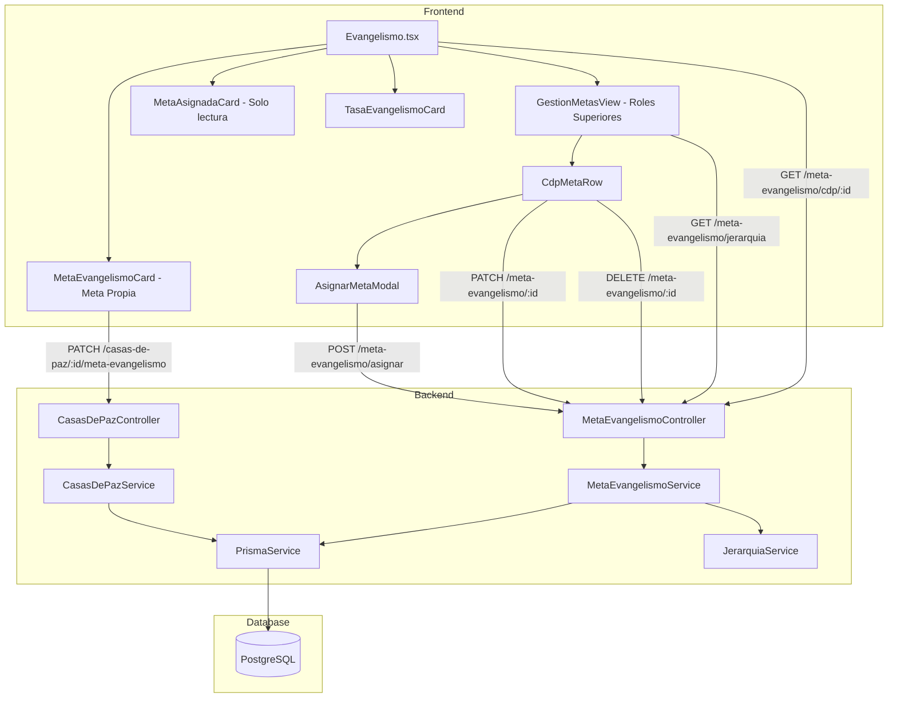

# Documento de Diseño: Rediseño del Módulo de Evangelismo

## Overview

Este rediseño introduce una distinción formal entre dos tipos de metas de evangelismo: la **meta propia** (establecida por el Líder_CDP para sí mismo) y la **meta asignada** (establecida por un rol superior con período de vigencia). La meta asignada tiene prioridad sobre la meta propia para el cálculo de la Tasa de Evangelismo.

El sistema agrega una nueva tabla `meta_evangelismo_asignada`, nuevos endpoints de API para gestión jerárquica de metas, y rediseña la vista de Evangelismo para mostrar ambas metas con sus controles correspondientes según el rol del usuario. Los roles superiores obtienen una vista de gestión que lista todas las CDPs bajo su jerarquía.

### Principios de diseño

- **Compatibilidad total**: el endpoint `PATCH /casas-de-paz/:id/meta-evangelismo` y el campo `meta_evangelismo` en `casa_de_paz` se preservan sin cambios.
- **Autorización jerárquica**: cada operación valida que el usuario tenga autoridad sobre la CDP objetivo según la jerarquía Iglesia → Red → Casa de Paz.
- **Meta efectiva**: la lógica de cálculo de tasa siempre usa `metaVigente` si existe, de lo contrario `metaPropia`.

## Architecture



### Flujo de datos

1. **Vista Líder**: `GET /meta-evangelismo/cdp/:casaDePazId` → retorna `{ metaPropia, metaAsignada }` → frontend renderiza dos tarjetas separadas.
2. **Vista Roles Superiores**: `GET /meta-evangelismo/jerarquia` → retorna lista de CDPs con metas y progreso → frontend renderiza tabla de gestión.
3. **Asignación**: `POST /meta-evangelismo/asignar` → valida jerarquía → soft-delete meta vigente anterior → crea nueva → retorna registro con datos del asignador.
4. **Cálculo de tasa**: lógica pura en frontend — usa `metaAsignada.meta` si existe y está vigente, sino `metaPropia`.

## Components and Interfaces

### Backend: Nuevo módulo `MetaEvangelismo`

#### Prisma Schema — nueva tabla

```prisma
model MetaEvangelismoAsignada {
  id                  Int       @id @default(autoincrement())
  casaDePazId         Int       @map("casa_de_paz_id")
  asignadorUsuarioId  Int       @map("asignador_usuario_id")
  meta                Int
  fechaInicio         DateTime  @map("fecha_inicio") @db.Date
  fechaFin            DateTime  @map("fecha_fin") @db.Date
  observaciones       String?
  createdAt           DateTime  @default(now()) @map("created_at")
  updatedAt           DateTime  @updatedAt @map("updated_at")
  createdBy           Int?      @map("created_by")
  updatedBy           Int?      @map("updated_by")
  deletedAt           DateTime? @map("deleted_at")
  deletedBy           Int?      @map("deleted_by")

  // Relations
  casaDePaz           CasaDePaz @relation(fields: [casaDePazId], references: [id])
  asignador           Usuario   @relation(fields: [asignadorUsuarioId], references: [id])

  @@index([casaDePazId])
  @@index([asignadorUsuarioId])
  @@index([fechaInicio])
  @@index([fechaFin])
  @@map("meta_evangelismo_asignada")
}
```

Se agrega la relación inversa en `CasaDePaz`:
```prisma
metasAsignadas  MetaEvangelismoAsignada[]
```

Y en `Usuario`:
```prisma
metasAsignadas  MetaEvangelismoAsignada[] @relation("MetasAsignadasPorUsuario")
```

#### DTOs

```typescript
// dto/asignar-meta.dto.ts
export class AsignarMetaEvangelismoDto {
  @IsInt() @Min(1)
  casaDePazId: number;

  @IsInt() @Min(1)
  meta: number;

  @IsDateString()
  fechaInicio: string; // ISO date "YYYY-MM-DD"

  @IsDateString()
  fechaFin: string;

  @IsOptional() @IsString()
  observaciones?: string;
}

// dto/update-meta-asignada.dto.ts
export class UpdateMetaAsignadaDto {
  @IsOptional() @IsInt() @Min(1)
  meta?: number;

  @IsOptional() @IsDateString()
  fechaInicio?: string;

  @IsOptional() @IsDateString()
  fechaFin?: string;

  @IsOptional() @IsString()
  observaciones?: string;
}
```

#### Controller: `MetaEvangelismoController`

```typescript
@Controller('meta-evangelismo')
export class MetaEvangelismoController {
  // GET /meta-evangelismo/cdp/:casaDePazId
  // Retorna { metaPropia, metaAsignada } para una CDP
  // Accesible por cualquier usuario con acceso a la CDP
  async getMetaCdp(@Param('casaDePazId') id: number): Promise<MetaCdpResponse>

  // GET /meta-evangelismo/jerarquia
  // Retorna lista de CDPs bajo la jerarquía del usuario autenticado con sus metas
  // Solo para roles superiores
  async getJerarquia(@CurrentUser() user): Promise<CdpConMetaResponse[]>

  // POST /meta-evangelismo/asignar
  // Crea una nueva meta asignada para una CDP
  // Solo para roles superiores con autoridad sobre la CDP
  async asignar(@Body() dto: AsignarMetaEvangelismoDto, @CurrentUser() user): Promise<MetaAsignadaResponse>

  // PATCH /meta-evangelismo/:id
  // Modifica una meta asignada (solo el asignador original)
  async update(@Param('id') id: number, @Body() dto: UpdateMetaAsignadaDto, @CurrentUser() user): Promise<MetaAsignadaResponse>

  // DELETE /meta-evangelismo/:id
  // Soft-delete de una meta asignada (solo el asignador original)
  async remove(@Param('id') id: number, @CurrentUser() user): Promise<void>
}
```

#### Service: `MetaEvangelismoService`

```typescript
@Injectable()
export class MetaEvangelismoService {
  // Retorna metaPropia + metaVigente para una CDP
  async getMetaCdp(casaDePazId: number): Promise<MetaCdpResponse>

  // Retorna CDPs bajo la jerarquía del usuario con sus metas y progreso
  async getCdpsJerarquia(userId: number, rolNombre: string, contextoId: number): Promise<CdpConMetaResponse[]>

  // Crea meta asignada, soft-delete de la vigente anterior si existe
  async asignar(dto: AsignarMetaEvangelismoDto, userId: number): Promise<MetaAsignadaResponse>

  // Actualiza meta asignada (verifica que userId == asignadorUsuarioId)
  async update(metaId: number, dto: UpdateMetaAsignadaDto, userId: number): Promise<MetaAsignadaResponse>

  // Soft-delete (verifica que userId == asignadorUsuarioId)
  async remove(metaId: number, userId: number): Promise<void>

  // Verifica autoridad jerárquica del usuario sobre la CDP
  private async verificarAutoridad(userId: number, casaDePazId: number): Promise<void>

  // Obtiene la meta vigente (fecha_inicio <= hoy <= fecha_fin, no deleted)
  private async getMetaVigente(casaDePazId: number): Promise<MetaEvangelismoAsignada | null>
}
```

#### Lógica de autorización jerárquica

```typescript
// Dentro de verificarAutoridad()
// 1. Obtener rol activo del usuario
const rolUsuario = await prisma.usuarioRolSistema.findFirst({
  where: { usuarioId, deletedAt: null, fechaFin: null },
  include: { rol: true, red: true }
});

// 2. Obtener la CDP con su red e iglesia
const cdp = await prisma.casaDePaz.findUnique({
  where: { id: casaDePazId },
  include: { red: { include: { iglesia: true } } }
});

// 3. Verificar según rol:
switch (rolUsuario.rol.nombre) {
  case 'PASTOR':
    // Autorizado si cdp.red.iglesiaId == rolUsuario.iglesiaId
  case 'SUPERVISOR_VISION_ACCION':
    // Autorizado si cdp.red.iglesiaId == rolUsuario.iglesiaId
    // (supervisa todas las redes de su iglesia)
  case 'LIDER_RED':
    // Autorizado si cdp.redId == rolUsuario.redId
  case 'SUBLIDER_RED':
    // Autorizado si cdp.redId == rolUsuario.redId
  case 'LIDER_CDP':
  case 'SUBLIDER_CDP':
    // No autorizado — lanzar ForbiddenException
}
```

### Frontend: Nuevos componentes

#### `MetaAsignadaCard`

Tarjeta de solo lectura que muestra la meta asignada vigente con información del asignador.

```typescript
interface MetaAsignadaCardProps {
  metaAsignada: MetaAsignadaInfo | null;
}

interface MetaAsignadaInfo {
  meta: number;
  asignadorNombre: string;
  asignadorRol: string;
  fechaInicio: string;
  fechaFin: string;
}
```

Comportamiento:
- Si `metaAsignada` es null → muestra "Sin meta asignada"
- Si existe → muestra el valor de la meta y debajo: nombre del asignador, su rol y el período `fechaInicio – fechaFin`
- Sin controles de edición (siempre solo lectura para el líder)

#### `GestionMetasView`

Vista para roles superiores. Muestra una tabla de CDPs bajo su jerarquía.

```typescript
interface GestionMetasViewProps {
  userId: number;
}
```

Comportamiento:
- Carga `GET /meta-evangelismo/jerarquia`
- Muestra filtro por red
- Por cada CDP: código, meta vigente, meta propia, evangelizados del período, tasa
- Si no hay meta vigente → botón "Asignar meta"
- Si hay meta vigente asignada por el usuario actual → botones "Editar" y "Eliminar"
- Si hay meta vigente asignada por otro usuario → solo lectura

#### `AsignarMetaModal`

Modal con formulario de asignación/edición de meta.

```typescript
interface AsignarMetaModalProps {
  casaDePazId: number;
  casaDePazCodigo: string;
  metaExistente?: MetaAsignadaInfo; // para modo edición
  onSuccess: () => void;
  onClose: () => void;
}
```

Campos: meta (entero positivo), fecha_inicio (date picker), fecha_fin (date picker), observaciones (textarea opcional).

#### `TasaEvangelismoCard` — actualización

Se actualiza para recibir `metaEfectiva` y `fuenteMeta` en lugar de solo `metaEvangelismo`:

```typescript
interface TasaEvangelismoCardProps {
  evangelizados: number;
  metaEfectiva: number | null;
  fuenteMeta: 'asignada' | 'propia' | null;
}
```

Muestra un indicador textual: "Usando meta asignada" o "Usando meta propia" según `fuenteMeta`.

#### Actualización de `Evangelismo.tsx`

```typescript
// Estado adicional
const [metaAsignada, setMetaAsignada] = useState<MetaAsignadaInfo | null>(null);
const isRolSuperior = roles?.some(r => ['PASTOR','LIDER_RED','SUBLIDER_RED','SUPERVISOR_VISION_ACCION'].includes(r));

// Nuevo endpoint para cargar ambas metas
const loadMetas = async () => {
  const { metaPropia, metaAsignada } = await metaEvangelismoService.getMetaCdp(casaDePazId);
  setMetaEvangelismo(metaPropia);
  setMetaAsignada(metaAsignada);
};

// Meta efectiva para la tasa
const metaEfectiva = metaAsignada?.meta ?? metaEvangelismo;
const fuenteMeta = metaAsignada ? 'asignada' : metaEvangelismo ? 'propia' : null;
```

La página renderiza:
- Si `isRolSuperior`: `<GestionMetasView />` en lugar de las tarjetas de meta
- Si `LIDER_CDP` o `SUBLIDER_CDP`: las tres tarjetas KPI (Evangelizados, Meta Propia editable, Meta Asignada solo lectura) + tasa

### Frontend: Nuevo servicio `metaEvangelismoService`

```typescript
// services/meta-evangelismo.service.ts
export const metaEvangelismoService = {
  async getMetaCdp(casaDePazId: number): Promise<MetaCdpResponse>,
  async getJerarquia(): Promise<CdpConMetaResponse[]>,
  async asignar(dto: AsignarMetaDto): Promise<MetaAsignadaResponse>,
  async update(metaId: number, dto: UpdateMetaDto): Promise<MetaAsignadaResponse>,
  async remove(metaId: number): Promise<void>,
};
```

## Data Models

### Modelo de base de datos

```sql
CREATE TABLE meta_evangelismo_asignada (
  id                    SERIAL PRIMARY KEY,
  casa_de_paz_id        INTEGER NOT NULL REFERENCES casa_de_paz(id),
  asignador_usuario_id  INTEGER NOT NULL REFERENCES usuario(id),
  meta                  INTEGER NOT NULL CHECK (meta > 0),
  fecha_inicio          DATE NOT NULL,
  fecha_fin             DATE NOT NULL,
  observaciones         TEXT,
  created_at            TIMESTAMPTZ NOT NULL DEFAULT NOW(),
  updated_at            TIMESTAMPTZ NOT NULL DEFAULT NOW(),
  created_by            INTEGER,
  updated_by            INTEGER,
  deleted_at            TIMESTAMPTZ,
  deleted_by            INTEGER,
  CONSTRAINT fecha_valida CHECK (fecha_fin >= fecha_inicio)
);

CREATE INDEX idx_meta_ev_asig_cdp ON meta_evangelismo_asignada(casa_de_paz_id);
CREATE INDEX idx_meta_ev_asig_asignador ON meta_evangelismo_asignada(asignador_usuario_id);
CREATE INDEX idx_meta_ev_asig_fechas ON meta_evangelismo_asignada(fecha_inicio, fecha_fin);
```

### Modelos de respuesta de la API

```typescript
// GET /meta-evangelismo/cdp/:casaDePazId
interface MetaCdpResponse {
  metaPropia: number | null;
  metaAsignada: {
    id: number;
    meta: number;
    fechaInicio: string;
    fechaFin: string;
    observaciones: string | null;
    asignador: {
      id: number;
      nombreCompleto: string;
      rol: string;
    };
  } | null;
}

// GET /meta-evangelismo/jerarquia
interface CdpConMetaResponse {
  casaDePazId: number;
  codigo: string;
  redNombre: string;
  metaPropia: number | null;
  metaAsignada: MetaAsignadaDetalle | null;
  evangelizadosPeriodo: number;
  tasaEvangelismo: number | null;
  metaAsignadaPorMi: boolean; // true si el usuario autenticado es el asignador
}

// POST /meta-evangelismo/asignar y PATCH /meta-evangelismo/:id
interface MetaAsignadaResponse {
  id: number;
  casaDePazId: number;
  meta: number;
  fechaInicio: string;
  fechaFin: string;
  observaciones: string | null;
  asignador: {
    id: number;
    nombreCompleto: string;
    rol: string;
  };
}
```

### Tipos frontend

```typescript
// types/meta-evangelismo.types.ts
export interface MetaAsignadaInfo {
  id: number;
  meta: number;
  fechaInicio: string;
  fechaFin: string;
  observaciones?: string | null;
  asignadorNombre: string;
  asignadorRol: string;
  asignadorId: number;
}

export interface CdpConMeta {
  casaDePazId: number;
  codigo: string;
  redNombre: string;
  metaPropia: number | null;
  metaAsignada: MetaAsignadaInfo | null;
  evangelizadosPeriodo: number;
  tasaEvangelismo: number | null;
  metaAsignadaPorMi: boolean;
}
```


## Correctness Properties

*A property is a characteristic or behavior that should hold true across all valid executions of a system — esencialmente, una declaración formal sobre lo que el sistema debe hacer. Las propiedades sirven como puente entre las especificaciones legibles por humanos y las garantías de corrección verificables por máquina.*

### Property 1: Autorización jerárquica para asignación de metas

*Para cualquier* usuario y Casa de Paz, el sistema debe autorizar la asignación de una meta si y solo si el usuario tiene un rol superior (PASTOR, SUPERVISOR_VISION_ACCION, LIDER_RED o SUBLIDER_RED) con autoridad jerárquica sobre esa CDP. Cualquier otro rol debe ser rechazado con 403.

**Validates: Requirements 2.1, 10.1, 10.2, 10.3, 10.4, 10.5, 10.6**

### Property 2: Round-trip de creación de meta asignada

*Para cualquier* combinación válida de (meta > 0, fecha_inicio, fecha_fin donde fin >= inicio), crear una meta asignada y luego consultarla debe retornar exactamente los mismos valores de meta, fecha_inicio y fecha_fin, con el asignador_usuario_id igual al usuario autenticado que realizó la creación.

**Validates: Requirements 2.2, 4.1, 4.2, 4.4**

### Property 3: Rechazo de fechas inválidas

*Para cualquier* par de fechas donde fecha_fin < fecha_inicio, el backend debe rechazar la solicitud de asignación o modificación con un error 400 descriptivo.

**Validates: Requirements 2.3, 3.3**

### Property 4: Rechazo de meta no positiva

*Para cualquier* valor de meta menor o igual a cero (incluyendo negativos), el backend debe rechazar la solicitud con un error 400 descriptivo, tanto para asignación como para actualización de meta propia.

**Validates: Requirements 2.4, 5.4**

### Property 5: Unicidad de meta vigente por CDP

*Para cualquier* Casa de Paz, después de crear una nueva meta asignada, debe existir exactamente una meta asignada activa (no eliminada) para esa CDP. Las metas vigentes anteriores deben haber sido marcadas con soft-delete.

**Validates: Requirements 2.5**

### Property 6: Autorización de modificación solo para el asignador original

*Para cualquier* meta asignada y cualquier usuario, la modificación o eliminación de esa meta debe ser autorizada si y solo si el usuario autenticado es el mismo que la creó (asignador_usuario_id). Cualquier otro usuario debe recibir un error 403.

**Validates: Requirements 3.1, 3.2**

### Property 7: Meta vigente determinada por rango de fechas

*Para cualquier* Casa de Paz, la meta retornada como "vigente" en `GET /meta-evangelismo/cdp/:id` debe ser aquella cuya fecha_inicio <= fecha_actual <= fecha_fin y que no esté eliminada. Si no existe ninguna que cumpla esta condición, el campo metaAsignada debe ser null.

**Validates: Requirements 4.2, 4.3**

### Property 8: Cálculo correcto de la Tasa de Evangelismo

*Para cualquier* valor de evangelizados >= 0 y meta efectiva > 0, la tasa calculada debe ser exactamente `(evangelizados / metaEfectiva) * 100`, redondeada a dos decimales. La meta efectiva es la meta asignada vigente si existe, de lo contrario la meta propia.

**Validates: Requirements 7.1, 7.2, 7.4**

### Property 9: Formato de la Tasa de Evangelismo

*Para cualquier* valor de tasa calculado (incluyendo valores > 100%), la cadena mostrada debe cumplir el formato `^\d+\.\d{2}%$` — es decir, un número entero o decimal seguido de exactamente dos decimales y el símbolo "%", sin truncar valores superiores al 100%.

**Validates: Requirements 7.4, 7.5, 7.6**

### Property 10: Validación del formulario de asignación

*Para cualquier* combinación de inputs inválidos en el formulario de asignación (meta <= 0, o fecha_fin <= fecha_inicio), el formulario debe rechazar el envío y mostrar un mensaje de error. Para cualquier combinación válida (meta > 0, fecha_fin > fecha_inicio), el formulario debe permitir el envío.

**Validates: Requirements 9.2, 9.3**

## Error Handling

### Errores del backend

| Escenario | Status | Mensaje |
|---|---|---|
| CDP no encontrada | 404 | "Casa de Paz no encontrada" |
| Meta asignada no encontrada | 404 | "Meta asignada no encontrada" |
| Usuario no tiene autoridad jerárquica | 403 | "No tienes autoridad sobre esta Casa de Paz" |
| Usuario no es el asignador original | 403 | "Solo el asignador original puede modificar esta meta" |
| LIDER_CDP o SUBLIDER_CDP intenta asignar | 403 | "Tu rol no permite asignar metas a otras CDPs" |
| fecha_fin < fecha_inicio | 400 | "La fecha de fin debe ser posterior a la fecha de inicio" |
| meta <= 0 | 400 | "La meta debe ser un número entero positivo" |
| meta_propia <= 0 (no null) | 400 | "La meta debe ser un número positivo o null" |

### Errores del frontend

1. **Error de red**: toast de error con mensaje del servidor; el estado de la UI no cambia (no optimistic update para operaciones de escritura).
2. **Error de validación del formulario**: mensaje inline debajo del campo inválido; el botón de envío permanece deshabilitado.
3. **Error 403**: toast explicando que no tiene permisos; se ocultan los controles de edición.
4. **Meta null/undefined**: se muestra "Sin meta propia" o "Sin meta asignada" según corresponda; nunca se lanza excepción.
5. **Carga fallida de jerarquía**: mensaje de error con botón de reintento en la vista de gestión.

### Estrategia de recuperación

- Las operaciones de escritura no usan optimistic updates; la UI se actualiza solo tras confirmación del servidor.
- Si `getMetaCdp` falla, la página muestra las tarjetas con valores null (degradación elegante).
- El formulario de asignación limpia su estado al cerrar, independientemente del resultado.

## Testing Strategy

### Enfoque dual

- **Tests unitarios**: ejemplos específicos, casos borde y condiciones de error.
- **Tests de propiedades**: propiedades universales con fast-check (mínimo 100 iteraciones por propiedad).

### Tests unitarios

Casos específicos a cubrir:

- Endpoint existente `PATCH /casas-de-paz/:id/meta-evangelismo` retorna el mismo contrato (compatibilidad).
- `MetaAsignadaCard` renderiza "Sin meta asignada" cuando `metaAsignada` es null.
- `MetaAsignadaCard` muestra nombre del asignador, rol y período cuando existe meta.
- `GestionMetasView` muestra botón "Asignar" cuando no hay meta vigente.
- `GestionMetasView` muestra botones "Editar"/"Eliminar" solo para metas asignadas por el usuario actual.
- `AsignarMetaModal` deshabilita el botón de envío con inputs inválidos.
- `TasaEvangelismoCard` muestra "Sin meta" cuando `metaEfectiva` es null o 0.
- `TasaEvangelismoCard` muestra indicador "Usando meta asignada" vs "Usando meta propia".
- Soft-delete de meta vigente anterior al crear nueva (test de integración con BD).

### Tests de propiedades (fast-check)

```typescript
import fc from 'fast-check';
const testConfig = { numRuns: 100 };
```

**Property 1 — Autorización jerárquica**
```typescript
// Feature: rediseno-modulo-evangelismo, Property 1: Hierarchical authorization
fc.assert(fc.asyncProperty(
  fc.record({
    rol: fc.constantFrom('PASTOR','LIDER_RED','SUBLIDER_RED','SUPERVISOR_VISION_ACCION','LIDER_CDP','SUBLIDER_CDP'),
    casaDePazId: fc.integer({ min: 1 }),
  }),
  async ({ rol, casaDePazId }) => {
    const esRolSuperior = ['PASTOR','LIDER_RED','SUBLIDER_RED','SUPERVISOR_VISION_ACCION'].includes(rol);
    // Si el rol no es superior, debe retornar 403
    // Si es superior pero sin jerarquía sobre la CDP, debe retornar 403
    // Si es superior con jerarquía, debe retornar 201
  }
), testConfig);
```

**Property 2 — Round-trip de creación**
```typescript
// Feature: rediseno-modulo-evangelismo, Property 2: Creation round-trip
fc.assert(fc.asyncProperty(
  fc.record({
    meta: fc.integer({ min: 1, max: 10000 }),
    fechaInicio: fc.date({ min: new Date('2024-01-01'), max: new Date('2025-01-01') }),
    diasDuracion: fc.integer({ min: 1, max: 365 }),
  }),
  async ({ meta, fechaInicio, diasDuracion }) => {
    const fechaFin = new Date(fechaInicio.getTime() + diasDuracion * 86400000);
    // Crear meta asignada, luego consultar, verificar que los valores coinciden
  }
), testConfig);
```

**Property 3 — Rechazo de fechas inválidas**
```typescript
// Feature: rediseno-modulo-evangelismo, Property 3: Invalid date rejection
fc.assert(fc.asyncProperty(
  fc.record({
    fechaInicio: fc.date(),
    diasAntes: fc.integer({ min: 1, max: 365 }),
  }),
  async ({ fechaInicio, diasAntes }) => {
    const fechaFin = new Date(fechaInicio.getTime() - diasAntes * 86400000);
    // Verificar que la API retorna 400
  }
), testConfig);
```

**Property 4 — Rechazo de meta no positiva**
```typescript
// Feature: rediseno-modulo-evangelismo, Property 4: Non-positive meta rejection
fc.assert(fc.asyncProperty(
  fc.integer({ max: 0 }),
  async (meta) => {
    // Verificar que la API retorna 400 para cualquier meta <= 0
  }
), testConfig);
```

**Property 5 — Unicidad de meta vigente**
```typescript
// Feature: rediseno-modulo-evangelismo, Property 5: Single active meta per CDP
fc.assert(fc.asyncProperty(
  fc.integer({ min: 1, max: 5 }), // número de asignaciones consecutivas
  async (numAsignaciones) => {
    // Crear N metas asignadas consecutivas para la misma CDP
    // Verificar que solo existe 1 activa al final
  }
), testConfig);
```

**Property 6 — Autorización de modificación**
```typescript
// Feature: rediseno-modulo-evangelismo, Property 6: Modification authorization
fc.assert(fc.asyncProperty(
  fc.record({
    esAsignadorOriginal: fc.boolean(),
    metaId: fc.integer({ min: 1 }),
  }),
  async ({ esAsignadorOriginal, metaId }) => {
    // Si es el asignador original → debe poder modificar
    // Si no lo es → debe recibir 403
  }
), testConfig);
```

**Property 7 — Meta vigente por rango de fechas**
```typescript
// Feature: rediseno-modulo-evangelismo, Property 7: Active meta by date range
fc.assert(fc.asyncProperty(
  fc.record({
    diasAntes: fc.integer({ min: 0, max: 30 }),
    diasDespues: fc.integer({ min: 0, max: 30 }),
  }),
  async ({ diasAntes, diasDespues }) => {
    const hoy = new Date();
    const fechaInicio = new Date(hoy.getTime() - diasAntes * 86400000);
    const fechaFin = new Date(hoy.getTime() + diasDespues * 86400000);
    // Crear meta con este rango, consultar, verificar que aparece como vigente
  }
), testConfig);
```

**Property 8 — Cálculo de tasa**
```typescript
// Feature: rediseno-modulo-evangelismo, Property 8: Tasa calculation
fc.assert(fc.property(
  fc.record({
    evangelizados: fc.integer({ min: 0, max: 10000 }),
    metaEfectiva: fc.integer({ min: 1, max: 10000 }),
  }),
  ({ evangelizados, metaEfectiva }) => {
    const tasa = calcularTasa(evangelizados, metaEfectiva);
    const esperado = parseFloat(((evangelizados / metaEfectiva) * 100).toFixed(2));
    return Math.abs(tasa - esperado) < 0.001;
  }
), testConfig);
```

**Property 9 — Formato de tasa**
```typescript
// Feature: rediseno-modulo-evangelismo, Property 9: Tasa formatting
fc.assert(fc.property(
  fc.double({ min: 0, max: 500, noNaN: true }),
  (tasaValue) => {
    const formatted = formatearTasa(tasaValue);
    return /^\d+\.\d{2}%$/.test(formatted);
  }
), testConfig);
```

**Property 10 — Validación del formulario**
```typescript
// Feature: rediseno-modulo-evangelismo, Property 10: Form validation
fc.assert(fc.property(
  fc.record({
    meta: fc.integer({ max: 0 }), // inválido
    fechaInicio: fc.date(),
    diasAntes: fc.integer({ min: 1, max: 30 }),
  }),
  ({ meta, fechaInicio, diasAntes }) => {
    const fechaFin = new Date(fechaInicio.getTime() - diasAntes * 86400000);
    const resultado = validarFormularioAsignacion({ meta, fechaInicio, fechaFin });
    return resultado.esValido === false && resultado.errores.length > 0;
  }
), testConfig);
```

### Organización de tests

```
backend/src/modules/meta-evangelismo/
  __tests__/
    meta-evangelismo.unit.test.ts
    meta-evangelismo.property.test.ts

frontend/src/
  components/evangelismo/__tests__/
    MetaAsignadaCard.test.tsx
    GestionMetasView.test.tsx
    AsignarMetaModal.test.tsx
    TasaEvangelismoCard.test.tsx
  utils/__tests__/
    tasa-evangelismo.property.test.ts
```
